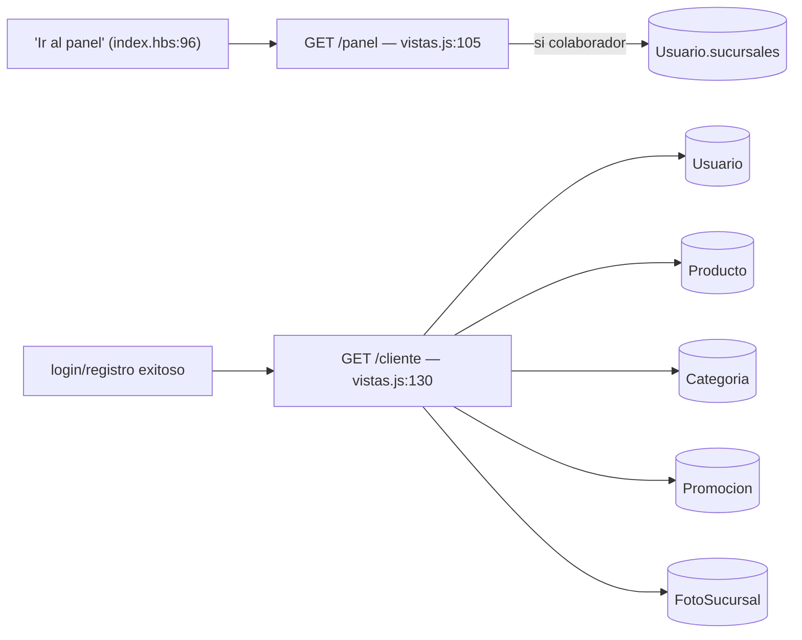
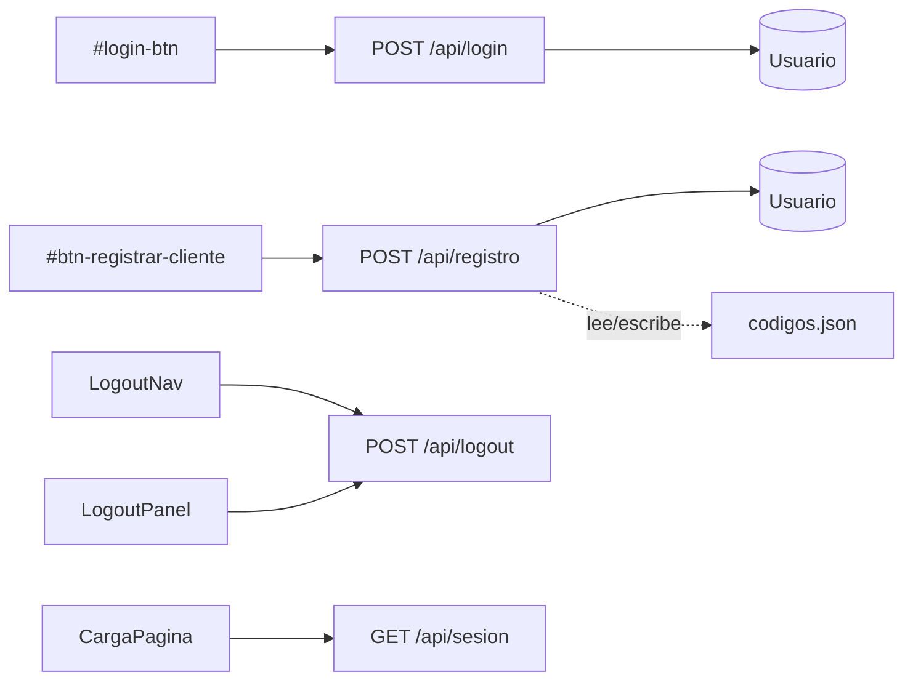
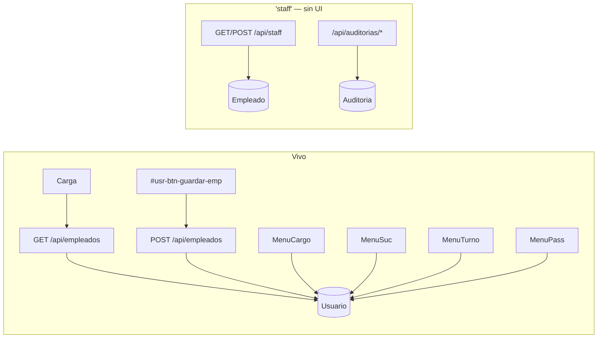
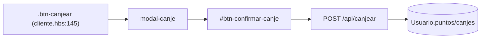
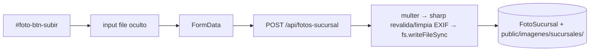
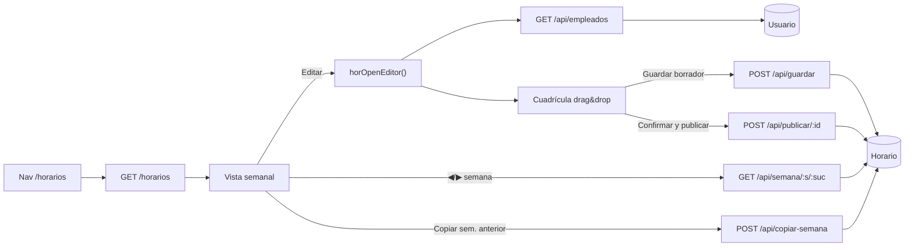
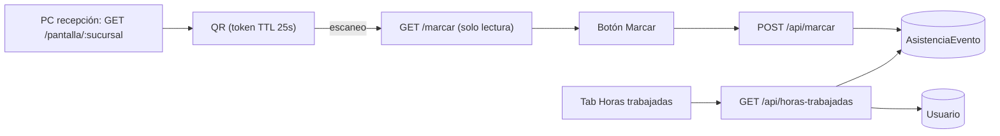
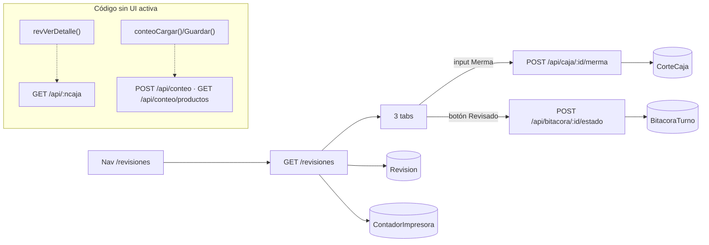

# CLAUDE.md

Esta guía le da a Claude Code (y a cualquiera que llegue nuevo al repo) el mapa completo de **qué botón de la UI dispara qué endpoint, en qué archivo/línea vive el handler, y qué modelo de Mongo toca** — para no tener que re-explorar `panel.hbs` (4,100 líneas) y los 20 archivos de rutas desde cero en cada sesión. Generado el 2026-08-03 mediante barrido sistemático (4 subagentes en paralelo, uno por módulo) + verificación cruzada.

## Qué es este proyecto

`i24h` es el panel web de una cadena de ciber/papelerías (9 sucursales): panel admin (empleados, ventas, inventario, bitácoras de turno, revisiones de caja, horarios, asistencia QR), panel de cliente (puntos, canjes, promociones) y home pública (comentarios/reseñas). Backend Express + MongoDB Atlas (Mongoose) + Handlebars. Desplegado en Render (`render.yaml`), repo en GitHub (`chriscontmtz-creator/i24h`).

El repo hermano `I24H-sync` (ver su propio `CLAUDE.md`) es el agente que sincroniza la base `.mdb` de CyberPlanet (punto de venta local en cada sucursal) hacia las mismas colecciones de MongoDB Atlas que este panel lee (`Producto`, `Ticket`, `CorteCaja`, etc.).

## Comandos

```bash
npm install
npm start              # node servidor.js — http://localhost:3000
```

Variables requeridas en `.env` (`src/config/db.js`, `servidor.js`):
- `MONGO_URI` — string de conexión Mongo Atlas (db `i24h`)
- `SESSION_SECRET` — obligatorio, el servidor no arranca sin él (`servidor.js:117-121`)
- `NODE_ENV=production` en Render (activa cookies `secure` + HSTS + `upgradeInsecureRequests`)
- `PORT` — opcional, default 3000

No hay suite de tests (`package.json` no define `test`).

## Arquitectura — mapa de montaje (`servidor.js`)

```
app.use('/',            vistasRoutes);       // GET /  /panel  /cliente
app.use('/api',         authRoutes);         // login, logout, registro, sesión
app.use('/api',         empleadosRoutes);    // empleados, staff, auditorías
app.use('/api',         clientesRoutes);     // clientes, puntos, canjes, canjear
app.use('/api',         usuariosRoutes);     // estado, delete, mi-perfil
app.use('/api',         codigosRoutes);      // códigos de registro
app.use('/api',         comentariosRoutes);  // comentarios (home pública)
app.use('/api',         ventasRoutes);       // ventas (mock JSON)
app.use('/api',         materialRoutes);     // venta sin material/sin tickets
app.use('/api',         resumenRoutes);      // resumen (KPIs dashboard)
app.use('/horarios',    horariosRoutes);     // módulo propio
app.use('/asistencia',  asistenciaRoutes);   // checador QR
app.use('/api',         reportesRoutes);     // reportes de departamento
app.use('/dashboard',   dashboardRoutes);    // dashboard analítico
app.use('/revisiones',  revisionesRoutes);   // revisiones/contadores de caja
app.use('/api',         bitacorasRoutes);    // bitácoras de turno
app.use('/api',         ticketsRoutes);      // tickets del sync (CyberPlanet)
app.use('/api',         inventarioRoutes);   // inventario — descarga Excel
app.use('/api',         promocionesRoutes);  // promociones panel de cliente
app.use('/api',         fotosRoutes);        // fotos de sucursal
```

**Vistas que comparten `panel.hbs`** (panel admin, todas las secciones abajo salvo Horarios/Asistencia/Dashboard/Revisiones que tienen vista propia): navegación por `data-seccion` + `irSeccion()`, sin recargar página — casi todo el JS del panel vive **inline en `<script>` dentro de `panel.hbs`**, no en archivos externos.

**Hallazgo transversal — `public/panel.js` está mayormente muerto.** Se carga en `/panel` (`src/routes/vistas.js:119`), pero sus `document.getElementById(...)` (`tabla-empleados-cuerpo`, `tabla-clientes-cuerpo`, `tabla-codigos-cuerpo`, `btn-generar-codigo`, `.tab-btn`, etc.) no existen en el `panel.hbs` actual — verificado con grep, cero coincidencias. El CRUD real de empleados/usuarios/clientes/códigos vive en los `<script>` inline de `panel.hbs` (funciones `usr*`, prefijo por sección: `promo*`, `foto*`, `vnt*`, `rpt*`, `bit*`). Solo el logout (`#panel-btn-logout`) de `panel.js` sigue ejecutándose. **Candidato a limpieza** — confirmar con el equipo antes de borrar por si algo externo aún lo referencia.

---

## 1. Vistas (`src/routes/vistas.js`)

| Elemento UI (archivo:línea) | Endpoint | Handler de ruta | Modelo(s) | Notas |
|---|---|---|---|---|
| Navegación directa `/` | `GET /` | `vistas.js:81` | ninguno | Renderiza `index.hbs`; middleware `sesionActual` |
| `<a href="/panel">Ir al panel ↗</a>` — `index.hbs:96,71-74` | `GET /panel` | `vistas.js:105` | `Usuario` (si `cargo==='colaborador'`, filtra sucursales) | `sesionActual` + `requireEmpleado` — bloquea clientes |
| Redirección tras login/registro (`JAVA.js:250`) | `GET /cliente` | `vistas.js:130` | `Usuario`, `Producto`, `Categoria`, `Promocion`, `FotoSucursal` | Genera QR de puntos, catálogo, promos vigentes, fotos de sucursal (SSR) |



## 2. Auth (`src/routes/auth.js`)

| Elemento UI (archivo:línea) | Handler JS | Endpoint | Handler de ruta | Modelo | Notas |
|---|---|---|---|---|---|
| Carga de página (index/cliente/panel) | `JAVA.js:535` (+ `panel.hbs:1538 perfilAbrirModal`) | `GET /api/sesion` | `auth.js:26` | — | Sincroniza `localStorage` con la sesión real |
| `#login-btn` — `index.hbs:300` | `JAVA.js:280-299` | `POST /api/login` | `auth.js:31` | `Usuario` | Rate-limit 10/15min; hash de relleno anti-timing-attack; regenera sesión |
| `#btn-cerrar-sesion-nav` — `index.hbs:81` | `JAVA.js:375-379` | `POST /api/logout` | `auth.js:77` | — | Destruye sesión, limpia cookie `i24h.sid` |
| `#panel-btn-logout` — `panel.hbs:116` | `panel.js:11-20` | `POST /api/logout` | `auth.js:77` | — | Segundo punto de entrada, vivo (a diferencia del resto de `panel.js`) |
| `#btn-registrar-cliente` — `index.hbs:396` | `JAVA.js:220-256` | `POST /api/registro` | `auth.js:85` | `Usuario` | Requiere código válido (`codigos.json`, no Mongo) |



## 3. Empleados (`src/routes/empleados.js`)

| Elemento UI (archivo:línea) | Handler JS | Endpoint | Handler de ruta | Modelo | Notas |
|---|---|---|---|---|---|
| Carga automática sección Usuarios | `panel.hbs:2218 usrCargarTodo()` | `GET /api/empleados` | `empleados.js:15` | `Usuario` (`cargo != cliente`) | Sin botón — fetch automático |
| `#usr-btn-nuevo-emp` → drawer → `#usr-btn-guardar-emp` — `panel.hbs:1215,2914` | `panel.hbs:2919-2960` | `POST /api/empleados` | `empleados.js:25` | `Usuario` | `requireAdmin` |
| Menú fila "Editar cargo" — `panel.hbs:2459` | `usrEditarCargo() panel.hbs:2686` | `PATCH /api/empleados/:id/cargo` | `empleados.js:45` | `Usuario` | `requireAdmin` |
| Menú fila "Cambiar sucursales" — `panel.hbs:2460` | `usrCambiarSucursales() panel.hbs:2716` | `PATCH /api/empleados/:id/sucursales` | `empleados.js:57` | `Usuario` | `requireAdmin` |
| Menú fila "Editar turno" — `panel.hbs:2461` | `usrEditarTurno() panel.hbs:2744` | `PATCH /api/empleados/:id/turno` | `empleados.js:68` | `Usuario` | `requireAdmin` |
| Menú fila "Cambiar contraseña" — `panel.hbs:2462` | `usrCambiarPassword() panel.hbs:2787` | `PATCH /api/empleados/:id/password` | `empleados.js:80` | `Usuario` | `requireAdmin` |
| **⚠️ sin UI encontrada** | — | `GET/POST /api/staff`, `GET /api/staff/:id/historial`, `PATCH /api/staff/:id`, `GET /api/auditorias/hoy`, `POST /api/auditorias` | `empleados.js:95-195` | `Empleado`, `Auditoria` | Módulo de evaluación de desempeño (puntos/bono) completo pero **sin ningún consumidor en el frontend** — `Empleado.js` es un modelo distinto de `Usuario.js` (el de auth, que sí está conectado) |



## 4. Usuarios (`src/routes/usuarios.js`)

| Elemento UI (archivo:línea) | Handler JS | Endpoint | Handler de ruta | Modelo | Notas |
|---|---|---|---|---|---|
| Toggle `.usr-tog` fila emp/cliente — `panel.hbs:2451,2488` | `usrToggleEstado() panel.hbs:2394` | `PATCH /api/usuarios/:id/estado` | `usuarios.js:8` | `Usuario` | `requireAdmin`. Copia muerta en `panel.js:478-493` |
| "Eliminar cuenta" — `panel.hbs:2463,2499` | `usrEliminarUsuario() panel.hbs:2409` | `DELETE /api/usuarios/:id` | `usuarios.js:21` | `Usuario` | `requireAdmin`; bloquea autoeliminación |
| Avatar sidebar → modal perfil → `#usr-btn-save` — `panel.hbs:107,1507` | `perfilGuardar() panel.hbs:1571` | `PATCH /api/mi-perfil` | `usuarios.js:37` | `Usuario` | Solo `requireEmpleado`; edita el propio perfil (`req.session.usuario.id`) |

## 5. Clientes (`src/routes/clientes.js`)

| Elemento UI (archivo:línea) | Handler JS | Endpoint | Handler de ruta | Modelo | Notas |
|---|---|---|---|---|---|
| Nav `data-seccion="usuarios"` — carga automática | `usrCargarTodo() panel.hbs:2218` | `GET /api/clientes` | `clientes.js:9` | `Usuario` (`cargo:'cliente'`) | `requireAuth` |
| Menú fila "Ajustar puntos" — `panel.hbs:2497` | `usrAjustarPuntos() panel.hbs:2816` | `PATCH /api/clientes/:id/puntos` | `clientes.js:19` | `Usuario` | `requireAdmin` |
| Menú fila "Ver canjes" — `panel.hbs:2496` | `usrVerCanjes() panel.hbs:2854` | `GET /api/clientes/:id/canjes` | `clientes.js:33` | `Usuario` | Solo `requireAuth` — cualquier empleado ve canjes de cualquier cliente |
| `.btn-canjear` → modal → `#btn-confirmar-canje` — `cliente.hbs:145,297` | `JAVA.js:421-468` | `POST /api/canjear` | `clientes.js:42` | `Usuario` | `requireAuth`; recompensas validadas contra `RECOMPENSAS` en `src/config/constants.js` (no Mongo) |



## 6. Códigos (`src/routes/codigos.js`)

No usa Mongo — persiste en `codigos.json` vía `src/utils/data.js`.

| Elemento UI (archivo:línea) | Handler JS | Endpoint | Handler de ruta | Notas |
|---|---|---|---|---|
| Carga automática sección Usuarios | `usrCargarTodo() panel.hbs:2218` | `GET /api/codigos` | `codigos.js:8` | `requireAuth` |
| Botón "Generar" `#usr-btn-gen-cod` — `panel.hbs:1289` | `panel.hbs:2962-2976` | `POST /api/codigos` | `codigos.js:14` | `requireAdmin`; genera 1/5/10 en bucle |
| Botón "Revocar" en tarjeta — `panel.hbs:2529` | `usrRevocarCodigo() panel.hbs:2537` | `DELETE /api/codigos/:id` | `codigos.js:38` | `requireAdmin`; rechaza si ya fue usado |

Consumo final del código: `POST /api/registro` (`auth.js`) valida el código que el cliente ingresa al registrarse.

## 7. Comentarios (`src/routes/comentarios.js`) — ⚠️ XSS confirmado, ver sección de seguridad

No usa Mongo — persiste en `comentarios.json`.

| Elemento UI (archivo:línea) | Handler JS | Endpoint | Handler de ruta | Notas |
|---|---|---|---|---|
| `#comments-list` — `index.hbs:217`, carga automática | `cargarComentarios() JAVA.js:128` | `GET /api/comentarios` | `comentarios.js:7` | **Sin autenticación** |
| `#comment-input` + `.star-btn` + `#submit-comment-btn` — `index.hbs:227-245` | `JAVA.js:150-172` | `POST /api/comentarios` | `comentarios.js:13` | **Sin autenticación** — cualquier visitante anónimo publica. XSS, ver abajo |
| `#emp-comment` + `#star-row-emp` + `#btn-calificar-emp` — `cliente.hbs:257-265` | `JAVA.js:471-493` | `POST /api/comentarios` | `comentarios.js:13` | Mismo endpoint, reutilizado para "calificar empleado"; este flujo concreto no repite el XSS porque no reinyecta la respuesta en el DOM |

## 8. Promociones (`src/routes/promociones.js`)

| Elemento UI (archivo:línea) | Handler JS | Endpoint | Handler de ruta | Modelo | Notas |
|---|---|---|---|---|---|
| Nav `data-seccion="promociones"` — `panel.hbs:83,1306` | `promoCargar() panel.hbs:3032` | `GET /api/promociones` | `promociones.js:8` | `Promocion` | `requireAuth`; filtro "vigente" es solo visual |
| `#promo-btn-nueva` — `panel.hbs:1309` | `promoAbrirNueva() panel.hbs:3076` | `POST /api/promociones` | `promociones.js:18` | `Promocion` | `requireAdmin` |
| "Editar" en tarjeta — `panel.hbs:3024` | `promoEditar() panel.hbs:3100` | `PATCH /api/promociones/:id` | `promociones.js:48` | `Promocion` | `requireAdmin`. Nota menor: campo `descripcion` no escapa comillas al insertarse en el `<textarea>` (`panel.hbs:3049`), inconsistente con el resto del form (bajo riesgo, solo admin) |
| "Eliminar" en tarjeta — `panel.hbs:3025` | `promoEliminar() panel.hbs:3126` | `DELETE /api/promociones/:id` | `promociones.js:85` | `Promocion` | `requireAdmin` |
| `#promociones` — `cliente.hbs:93-110` | SSR, sin fetch | *(datos ya renderizados en `GET /cliente`)* | — | `Promocion` | Solo lectura |

## 9. Fotos de sucursal (`src/routes/fotos.js`)

| Elemento UI (archivo:línea) | Handler JS | Endpoint | Handler de ruta | Modelo | Notas |
|---|---|---|---|---|---|
| Nav `data-seccion="fotos-sucursal"` + `#foto-sel-suc` — `panel.hbs:86,1326` | `fotoCargar() panel.hbs:3163` | `GET /api/fotos-sucursal?sucursal=` | `fotos.js:30` | `FotoSucursal` | `requireAuth` |
| `#foto-btn-subir` → `#foto-input-archivo` — `panel.hbs:1337-1340` | `panel.hbs:3182-3211` | `POST /api/fotos-sucursal` (multipart) | `fotos.js:55` | `FotoSucursal` | `requireAdmin`; `multer` (5MB) + `sharp` revalida imagen y **elimina EXIF/GPS** antes de guardar |
| "Eliminar" en tarjeta — `panel.hbs:3157` | `fotoEliminar() panel.hbs:3175` | `DELETE /api/fotos-sucursal/:id` | `fotos.js:91` | `FotoSucursal` | `requireAdmin`; borra registro + archivo (best-effort) |
| `#fotos-sucursal` — `cliente.hbs:113-127` | SSR | *(datos ya renderizados)* | — | `FotoSucursal` | Solo lectura |



## 10. Ventas (`src/routes/ventas.js`)

No usa Mongo — JSON planos (`ventas.json`, `productos.json`, `alertas.json`).

| Elemento UI (archivo:línea) | Handler JS | Endpoint | Handler de ruta | Notas |
|---|---|---|---|---|
| Pills `.vnt-pill` + `#vnt-suc-filter` — `panel.hbs:554-559` | `vntCargar() panel.hbs:3506` | `GET /api/ventas?sucursal=&periodo=` | `ventas.js:16` | Datos mock, no vienen del sync real |
| `#vnt-top-cat-filter` — `panel.hbs:628` | `vntCargarTop() panel.hbs:3629` | `GET /api/ventas/top-productos` | `ventas.js:58` | |
| Automático al final de `vntCargar()` | `vntCargarAlertas() panel.hbs:3659` | `GET /api/ventas/alertas` | `ventas.js:77` | También usado por el Dashboard |
| `#vnt-export-btn` — `panel.hbs:571` | `vntExportar() panel.hbs:3690` | *(sin API — CSV client-side)* | — | Exporta lo ya cargado en memoria |

## 11. Material (`src/routes/material.js`)

Modal "Venta sin material y sin tickets" (`#vsm-overlay`, `panel.hbs:3964-4100`), JS en `public/js/modal-material.js`.

| Elemento UI (archivo:línea) | Handler JS | Endpoint | Handler de ruta | Modelo | Notas |
|---|---|---|---|---|---|
| Nav sistema / botón sección Ventas → `abrirModalMaterial()` — `panel.hbs:77,578` → `#vsm-mat-btn-cargar` — `panel.hbs:4011` | `vsmCargarMaterial() modal-material.js:63` | `GET /api/material/resumen?sucursal=&fecha=` | `material.js:98` | `Ticket`, `Categoria`, `Producto` | Resta ventas de MATERIAL/NOVEDADES/SNACK del total |
| Tab "Tickets" → `#vsm-tk-btn-buscar` — `panel.hbs:3984,4065` | `vsmBuscarTicket() modal-material.js:108` | `GET /api/material/buscar-ticket` | `material.js:150` | `Ticket`, `AjusteTicket` | |
| `#vsm-tk-btn-aplicar` — `panel.hbs:4088` | `vsmAplicarAjuste() modal-material.js:157` | `POST /api/material/ajuste-ticket` | `material.js:178` | `Ticket`, `AjusteTicket` | `soloAdmin` |
| **⚠️ sin UI encontrada** | — | `GET /api/material/ajustes?sucursal=&fecha=` | `material.js:218` | `AjusteTicket` | Historial de ajustes, sin ningún `fetch` en el frontend |

## 12. Resumen (`src/routes/resumen.js`)

| Elemento UI (archivo:línea) | Handler JS | Endpoint | Handler de ruta | Modelo | Notas |
|---|---|---|---|---|---|
| Nav `data-seccion="dashboard"` (activo por defecto) — `panel.hbs:26` | `dashCargar() panel.hbs:3889` | `GET /api/resumen` | `resumen.js:9` | `Usuario` + `codigos.json`/`comentarios.json` | Cuenta empleados activos y clientes |
| Carga general del panel (redundante) | `panel.js:249` | `GET /api/resumen` | `resumen.js:9` | `Usuario` | Segundo consumidor del mismo endpoint — candidato a unificar |

## 13. Horarios (`src/routes/horarios.js`)

Vista propia: `src/views/horarios/index.hbs` · JS: `public/js/horarios.js` (1006 líneas).

| Elemento UI (archivo:línea) | Handler JS | Endpoint | Handler de ruta | Modelo | Notas |
|---|---|---|---|---|---|
| `<a href="/horarios">` — `panel.hbs:67,1176` | navegación de página | `GET /horarios` | `horarios.js:59` | `Horario`, `Usuario` | Renderiza con `horDataJson` inyectado |
| "Editar" por sucursal — `index.hbs:101` | `horOpenEditor()→horCargarRoster() horarios.js:394,452` | `GET /horarios/api/empleados` | `horarios.js:116` | `Usuario` | `requireAdmin` (agregado 2026-08-03, ver Pendientes de seguridad) |
| "◀"/"▶" semana — `index.hbs:23,27` | `horNavigateWeek()→horCargarSemana() horarios.js:147,154` | `GET /horarios/api/semana/:semana/:sucursal` | `horarios.js:129` | `Horario` | Solo `requireAuth` — cualquier empleado consulta cualquier sucursal, es de solo lectura |
| "Guardar borrador" — `index.hbs:225` | `horSaveGrid() horarios.js:885` | `POST /horarios/api/guardar` | `horarios.js:171` | `Horario` | Upsert `{sucursal,semana}`; `requireAdmin` (agregado 2026-08-03) |
| "Confirmar y publicar" / "Publicar horario" — `index.hbs:228,56` | `horPublishActive()/horPublicarActivo() horarios.js:917,937` | `POST /horarios/api/publicar/:id` | `horarios.js:227` | `Horario` | `requireAdmin` (agregado 2026-08-03) |
| "Copiar sem. anterior" — `index.hbs:51` | `horCopiarSemana() horarios.js:956` | `POST /horarios/api/copiar-semana` | `horarios.js:241` | `Horario` | `requireAdmin` (agregado 2026-08-03) |
| **⚠️ sin UI encontrada** | — | `DELETE /horarios/api/celda` | `horarios.js:268` | `Horario` | Endpoint huérfano, comentario dice "vacía una celda" pero nada lo dispara. `requireAdmin` (agregado 2026-08-03) |



**Nota de seguridad:** 4 de los 6 endpoints de escritura/lectura sensible de Horarios (`empleados`, `guardar`, `publicar`, `copiar-semana`) tienen un TODO explícito en el código marcando que falta `requireAdmin` — cualquier empleado logueado (no solo admin) puede hoy editar/publicar horarios de cualquier sucursal.

## 14. Asistencia (`src/routes/asistencia.js`)

Vistas: `src/views/asistencia/marcar.hbs`, `pantalla.hbs`. Sin JS propio en `public/js/` — handlers inline en las vistas; el tab "Horas trabajadas" vive en `public/js/horarios.js`.

| Elemento UI (archivo:línea) | Handler JS | Endpoint | Handler de ruta | Modelo | Notas |
|---|---|---|---|---|---|
| Pantalla de kiosco (PC recepción), auto-recarga — `pantalla.hbs:16` | — | `GET /asistencia/pantalla/:sucursal` | `asistencia.js:143` | — (token efímero en memoria) | Rate-limit propio (60/5min); genera QR |
| QR escaneado con el celular — `pantalla.hbs:4` | — | `GET /asistencia/marcar` | `asistencia.js:176` | `Horario` (solo lectura, best-effort) | GET sin efectos secundarios a propósito |
| Botones Entrada/Salida/Comida — `marcar.hbs:15,20,25,30` | `asMarcar() marcar.hbs:51` | `POST /asistencia/api/marcar` | `asistencia.js:213` | `AsistenciaEvento` | Único punto que escribe; revalida token + transición de estado server-side |
| Tab "Horas trabajadas" — `horarios/index.hbs:71-73` | `hasCargarSemana() horarios.js:220` | `GET /asistencia/api/horas-trabajadas` | `asistencia.js:230` | `AsistenciaEvento`, `Usuario` | `requireAdmin`; vive físicamente en el JS de Horarios |



## 15. Reportes (`src/routes/reportes.js`)

No usa Mongo — `datos/reportes.json`.

| Elemento UI (archivo:línea) | Handler JS | Endpoint | Handler de ruta | Notas |
|---|---|---|---|---|
| Solo dentro de `dashCargar()`, sin botón propio | `dashCargar() panel.hbs:3889` | `GET /api/reportes` | `reportes.js:8` | Alimenta solo el widget "Reportes recientes" del Dashboard; los filtros de la sección Reportes (`panel.hbs:1051-1102`) trabajan client-side sobre tarjetas ya en el DOM, no vuelven a llamar este GET |
| "Crear reporte" — `panel.hbs:996` | `rptCrearReporte() panel.hbs:3317` | `POST /api/reportes` | `reportes.js:20` | Inserción optimista en el feed |
| `.rpt-status-toggle` por tarjeta — `panel.hbs:1051,1068,1085,1102,3356` | `rptToggleStatus() panel.hbs:3295` | `PATCH /api/reportes/:id/status` | `reportes.js:44` | Solo persiste si la tarjeta tiene `data-rpt-id` (viene del POST) — las hardcodeadas en el `.hbs` cambian solo visualmente |

## 16. Dashboard (`src/routes/dashboard.js`)

Vista: `src/views/dashboard.hbs` · JS: `public/js/dashboard.js` (108 líneas, solo sidebar/dark-mode/gráfica, sin fetch propio).

| Elemento UI (archivo:línea) | Endpoint | Handler de ruta | Modelo | Notas |
|---|---|---|---|---|
| Nav "Dashboard" (`panel.hbs:23`), botón "Actualizar" (`dashboard.hbs:69`), filtros sucursal/periodo/turno (`dashboard.hbs:79-100`), links de día (`dashboard.hbs:105-110`) | `GET /dashboard` | `dashboard.js:100` | `Ticket`, `Producto`, `Usuario`, `CorteCaja`, `Revision` | Único endpoint del módulo; navegación GET completa, no AJAX. `Chart.js` solo pinta `window.DASH_DATA` ya renderizado server-side |

## 17. Revisiones (`src/routes/revisiones.js`, 666 líneas — el módulo más grande)

Vista: `src/views/revisiones/index.hbs` (con `<script>` inline) · JS: `public/js/revisiones.js` (490 líneas).

| Elemento UI (archivo:línea) | Handler JS | Endpoint | Handler de ruta | Modelo | Notas |
|---|---|---|---|---|---|
| Nav "Revisiones" + filtros + tabs — `panel.hbs:42`, `index.hbs:16-60` | `revFiltrar() revisiones.js:97` | `GET /revisiones` | `revisiones.js:104` | `Revision`, `ConteoFisico`, `ContadorImpresora`, `BitacoraTurno`, `CorteCaja`, `Ticket`, `Producto` | Agrega bitácoras + contadores + resumen de caja en 3 tabs |
| Input "Merma" — `index.hbs:339-347` | `rcGuardarMerma()` inline `index.hbs:418-447` | `POST /revisiones/api/caja/:id/merma` | `revisiones.js:628` | `CorteCaja` | Tab "Resumen de caja" |
| "Revisado"/"Pendiente" por bitácora — `index.hbs:96-105` | `bitToggleEstado()` inline `index.hbs:449-476` | `POST /revisiones/api/bitacora/:id/estado` | `revisiones.js:648` | `BitacoraTurno` | Tab "Revisiones por turno" |
| **⚠️ módulo "Conteo de inventario" completo, desconectado de la vista** — `conteoCargar/Guardar/VerDetalle` referencian IDs (`conteo-sucursal`, `conteo-overlay`...) que **no existen** en `index.hbs` (grep: 0 coincidencias) | `revisiones.js:302,371,407` | `GET /revisiones/api/conteo/productos`, `POST /revisiones/api/conteo`, `GET /revisiones/api/conteo/:id` | `revisiones.js:446,463,507` | `Producto`, `ConteoFisico` | JS completo (incluye polling cada 60s) sin ningún punto de entrada en la UI actual |
| **⚠️ botón inalcanzable** — "Aprobar revisión" existe en el DOM (`index.hbs:395`) pero el modal que lo contiene nunca se abre, porque `revVerDetalle()` no tiene ningún `onclick` que lo invoque | `revVerDetalle() revisiones.js:119`, `revAprobar() revisiones.js:192` | `GET /revisiones/api/:ncaja`, `POST /revisiones/api/:ncaja/aprobar` | `revisiones.js:518,538` | `Revision`, `ContadorImpresora` | Flujo completo de detalle/aprobación parece de una versión anterior de la vista |
| **⚠️ endpoints completamente muertos** — cero referencias en todo `public/` y `src/views/` | — | `POST /revisiones/api/:ncaja/causa`, `POST /revisiones/api/:ncaja/corregir` | `revisiones.js:563,595` | `Revision` | Ni siquiera hay código cliente que los invoque |



## 18. Bitácoras (`src/routes/bitacoras.js`)

Middleware: `sesionActual` + `requireEmpleado` en las 4 rutas. Depende de `BitacoraTurno` y del snapshot que produce `I24H-sync` (ver `I24H-sync/CLAUDE.md` sección 4 para el flujo T1→T2→T3 completo).

| Elemento UI (archivo:línea) | Handler JS | Endpoint | Handler de ruta | Modelo | Notas |
|---|---|---|---|---|---|
| "Iniciar conteo" `#btn-iniciar-conteo` — `panel.hbs:731,1965-2003` | listener inline | `GET /api/bitacora/snapshot-corte?sucursal=` | `bitacoras.js:79` | `Producto` (primario), `SnapshotCorte` (fallback) | Se deshabilita 15 min tras cada corte (`panel.hbs:2067-2125`) |
| "Cerrar bitácora del turno" `#btn-cerrar-bitacora` — `panel.hbs:773,2005-2064` | listener inline | `POST /api/bitacora/guardar` | `bitacoras.js:23` | `BitacoraTurno` | Valida `res-pendiente==0` client-side antes de permitir cerrar |
| `irSeccion('bitacoras',sucursal)` desde tarjetas — `panel.hbs:1634-1648` | `bitCargarHistorial() panel.hbs:2129` | `GET /api/bitacora/lista?sucursal=&limit=&skip=` | `bitacoras.js:53` | `BitacoraTurno` | `.select('-productos')` |
| `.bit-hist-fila` — `panel.hbs:2147` | `bitVerDetalle() panel.hbs:2163` | `GET /api/bitacora/:id` | `bitacoras.js:115` | `BitacoraTurno` | |

## 19. Tickets (`src/routes/tickets.js`)

| Elemento UI (archivo:línea) | Handler JS | Endpoint | Handler de ruta | Modelo | Notas |
|---|---|---|---|---|---|
| `#tkt-sucursal`, `#tkt-fecha`, `#btn-consultar-tickets` — `panel.hbs:670,681,682` | `consultarTickets() panel.hbs:3727` | `GET /api/tickets/dia?sucursal=&fecha=` | `tickets.js:46` | `Ticket` | Solo cuenta `tipo` en `[1,2,5,6]`; función `rangoDiaMX` tiene un bug de huso horario conocido (resta 6h de más) que nunca matchea tickets reales — no corregido, pendiente aparte |

## 20. Inventario (`src/routes/inventario.js`)

| Elemento UI (archivo:línea) | Handler JS | Endpoint | Handler de ruta | Modelo | Notas |
|---|---|---|---|---|---|
| Botones "Descargar" por categoría — `panel.hbs:918,923,928,933` | `descargarInventario(categoria) panel.hbs:3940` | `GET /api/inventario/descargar?sucursal=&categoria=&fecha=` | `inventario.js:194` | `Producto` | `sesionActual`+`requireEmpleado`; mapeo hardcodeado Excel↔DB (`inventario.js:49-188`); descarga vía `<a href>`, sin manejo de error JS |

---

## Enlaces de navegación desde `panel.hbs`

| Línea | `href` | ¿Ruta válida? |
|---|---|---|
| `panel.hbs:23` | `/dashboard` | ✅ |
| `panel.hbs:42` | `/revisiones` | ✅ |
| `panel.hbs:67` | `/horarios` | ✅ |
| `panel.hbs:1176` | `/horarios` | ✅ |

Sin `/asistencia` en `panel.hbs` — esperado, se accede vía QR desde `/asistencia/pantalla/:sucursal`, no desde el nav admin. **Estos 4 enlaces están bien** — no son la causa del pendiente "links de navegación rotos" registrado en QA (buscar en otras secciones del panel, como Empleados/Ventas, no cubiertas por este barrido de rutas).

---

## Pendientes de seguridad / calidad conocidos

### 🔴 XSS confirmado — comentarios de home pública (crítico, sin autenticación)

- **Sink:** `public/JAVA.js:109-125`, función `crearTarjetaComentario(c)`. Línea 113 arma un template string y lo asigna directamente como HTML del elemento (no como texto plano); línea 121 interpola `c.texto` sin ninguna función de escape.
- **Se dispara:** al cargar `/` para cualquier visitante (`JAVA.js:128-137`, `cargarComentarios`) y justo después de publicar (`JAVA.js:164`).
- **Fuente sin sanitizar:** `POST /api/comentarios` (`src/routes/comentarios.js:13-28`) no requiere sesión y solo hace `.trim()`; `GET /api/comentarios` (línea 7-10) tampoco requiere sesión.
- **Patrón correcto ya existe en el repo** (contraste): `panel.hbs` define `escHtml()` (línea 1512) y lo usa consistentemente en códigos/promociones — simplemente no se aplicó en `JAVA.js`.
- **Payload de prueba:** `POST /api/comentarios` anónimo con `texto = ""`, confirmar ejecución al recargar `/`.
- **Impacto:** XSS almacenado, cero autenticación requerida ni para escribir ni para disparar — expone a cualquier visitante anónimo del home. Corresponde al hallazgo "XSS pública en home comments" de la memoria de QA 2026-08-03.

### ✅ Horarios — `requireAdmin` faltante, ARREGLADO 2026-08-03

`horarios.js:116,171,227,241,268` (roster, guardar, publicar, copiar-semana, borrar celda) tenían un TODO explícito marcando la falta de `requireAdmin` — cualquier empleado logueado podía modificar/publicar horarios de cualquier sucursal, no solo administradores. Ya se agregó `requireAdmin` a las 5 rutas (verificado con grep).

### 🟡 Menor — `descripcion` sin escapar en formulario de Promociones

`panel.hbs:3049` no escapa comillas al insertar `descripcion` en el `<textarea>` de edición, a diferencia de los campos hermanos del mismo form. Bajo riesgo (input solo de admin autenticado), pero rompe el patrón de "siempre escapar" del resto del panel.

### Código muerto / módulos desconectados (no son bugs de seguridad, pero consumen mantenimiento)

- **`public/panel.js`** — mayormente muerto (empleados/clientes/códigos, líneas ~260-470); sus IDs de DOM no existen en `panel.hbs` actual. Solo el logout sigue vivo.
- **`empleados.js` — submódulo "staff/auditorías"** (6 endpoints, modelo `Empleado`) — sin ningún consumidor en el frontend.
- **`material.js:218`** — `GET /api/material/ajustes` sin UI.
- **`horarios.js:273`** — `DELETE /api/horarios/api/celda` sin UI.
- **`revisiones.js` — módulo "Conteo de inventario"** (3 endpoints) completamente desconectado de `index.hbs` actual.
- **`revisiones.js:518,538`** — flujo de detalle/aprobación de revisión con botón inalcanzable (el modal que lo contiene nunca se abre).
- **`revisiones.js:563,595`** — `/causa` y `/corregir`, cero referencias en todo el frontend.
- **`tickets.js`** — bug de huso horario conocido en `rangoDiaMX` (resta 6h de más), sin corregir.

### Pendientes de QA registrados en memoria (no verificados en este barrido — cubren archivos/secciones fuera del alcance de rutas API)

Ver memoria `i24h_qa_pendientes_2026-08-03.md` para el detalle original: nav links rotos (en secciones no cubiertas aquí), botón "Soy empleado" sin destino, firma de dev visible en footer, reseñas inapropiadas ya publicadas por limpiar antes de demo.

---

## Mantenimiento de este mapa

Este archivo se generó mediante barrido sistemático (grep + lectura dirigida, no manual) el 2026-08-03. **Al agregar una ruta o un botón nuevo, añade su fila a la tabla del módulo correspondiente** (o crea una sección nueva si es un módulo nuevo) — así el mapa no se desactualiza silenciosamente. Si una sección crece mucho, está bien dividirla, pero mantén el formato de tabla `Elemento UI → Handler JS → Endpoint → Handler de ruta → Modelo → Notas` para que sea grep-able.
