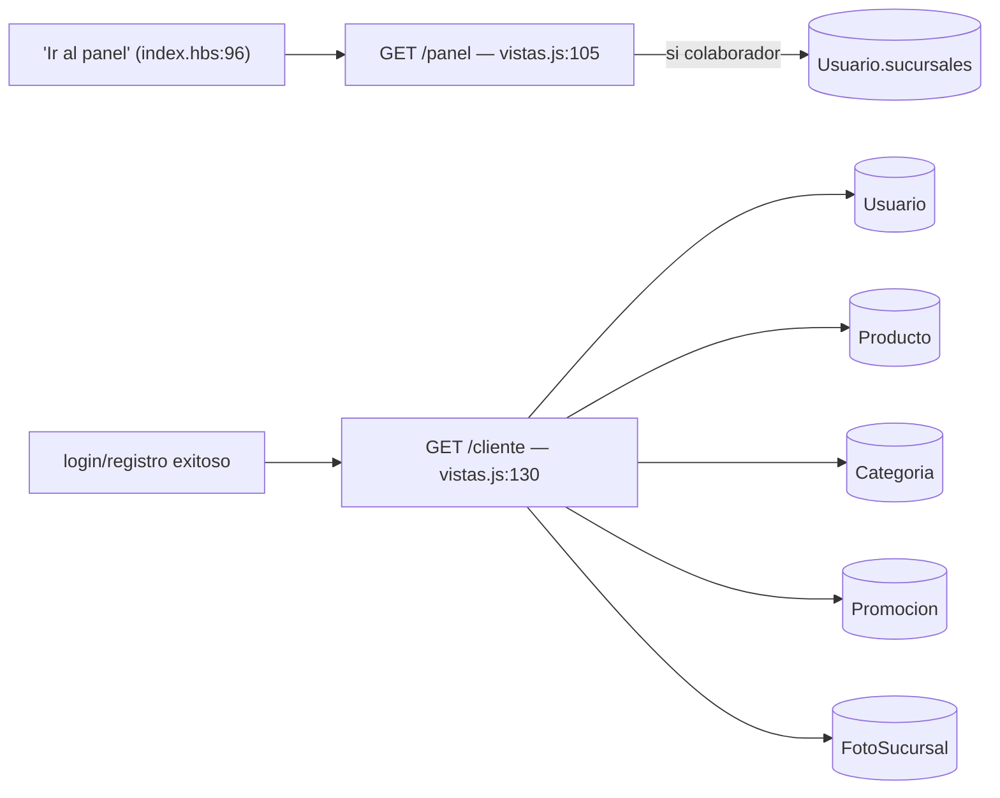
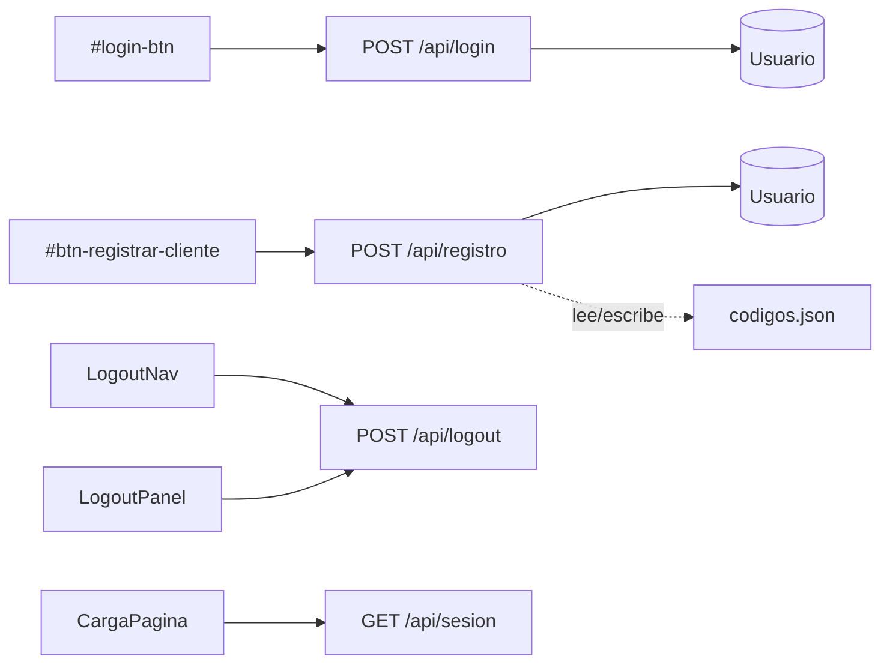
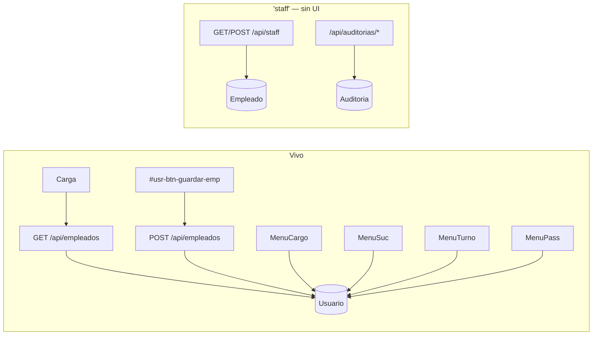
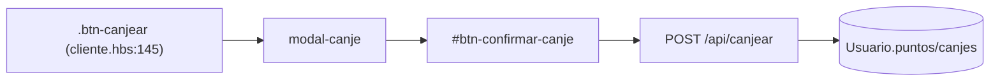
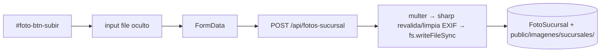
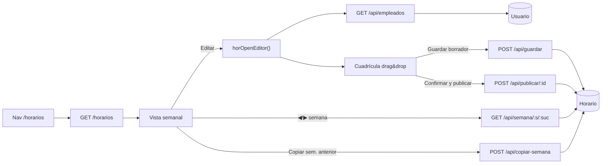
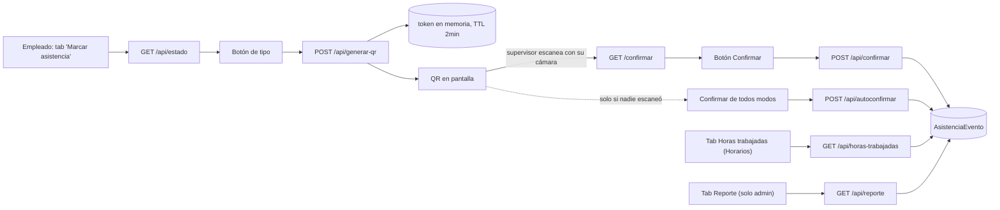
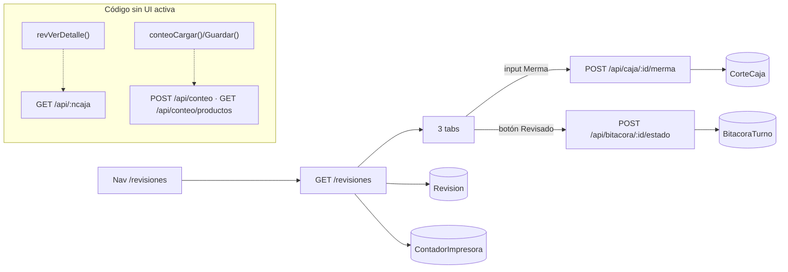
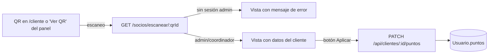

# CLAUDE.md

Esta guía le da a Claude Code (y a cualquiera que llegue nuevo al repo) el mapa completo de **qué botón de la UI dispara qué endpoint, en qué archivo/línea vive el handler, y qué modelo de Mongo toca** — para no tener que re-explorar `panel.hbs` (4,100 líneas) y los 20 archivos de rutas desde cero en cada sesión. Generado el 2026-08-03 mediante barrido sistemático (4 subagentes en paralelo, uno por módulo) + verificación cruzada.

## Qué es este proyecto

`i24h` es el panel web de una cadena de ciber/papelerías (9 sucursales): panel admin (empleados, ventas, inventario, bitácoras de turno, revisiones de caja, horarios, asistencia QR), panel de cliente (puntos, canjes, promociones) y home pública (comentarios/reseñas). Backend Express + MongoDB Atlas (Mongoose) + Handlebars. Desplegado en Render (`render.yaml`), repo en GitHub (`chriscontmtz-creator/i24h`).

El repo hermano `I24H-sync` (ver su propio `CLAUDE.md`) es el agente que sincroniza la base `.mdb` de CyberPlanet (punto de venta local en cada sucursal) hacia las mismas colecciones de MongoDB Atlas que este panel lee (`Producto`, `Ticket`, `CorteCaja`, etc.).

## Comandos

```bash
npm install
npm start              # node servidor.js — http://localhost:3000
```

Variables requeridas en `.env` (`src/config/db.js`, `servidor.js`):
- `MONGO_URI` — string de conexión Mongo Atlas (db `i24h`)
- `SESSION_SECRET` — obligatorio, el servidor no arranca sin él (`servidor.js:117-121`)
- `NODE_ENV=production` en Render (activa cookies `secure` + HSTS + `upgradeInsecureRequests`)
- `PORT` — opcional, default 3000

No hay suite de tests (`package.json` no define `test`).

## Arquitectura — mapa de montaje (`servidor.js`)

```
app.use('/',            vistasRoutes);       // GET /  /panel  /cliente
app.use('/api',         authRoutes);         // login, logout, registro, sesión
app.use('/api',         empleadosRoutes);    // empleados, staff, auditorías
app.use('/api',         clientesRoutes);     // clientes, puntos, canjes, canjear
app.use('/api',         usuariosRoutes);     // estado, delete, mi-perfil
app.use('/api',         codigosRoutes);      // códigos de registro
app.use('/api',         comentariosRoutes);  // comentarios (home pública)
app.use('/api',         ventasRoutes);       // ventas (mock JSON)
app.use('/api',         materialRoutes);     // venta sin material/sin tickets
app.use('/api',         resumenRoutes);      // resumen (KPIs dashboard)
app.use('/horarios',    horariosRoutes);     // módulo propio
app.use('/asistencia',  asistenciaRoutes);   // checador QR
app.use('/api',         reportesRoutes);     // reportes de departamento
app.use('/dashboard',   dashboardRoutes);    // dashboard analítico
app.use('/revisiones',  revisionesRoutes);   // revisiones/contadores de caja
app.use('/api',         bitacorasRoutes);    // bitácoras de turno
app.use('/api',         ticketsRoutes);      // tickets del sync (CyberPlanet)
app.use('/api',         inventarioRoutes);   // inventario — descarga Excel
app.use('/api',         promocionesRoutes);  // promociones panel de cliente
app.use('/api',         fotosRoutes);        // fotos de sucursal
app.use('/socios',      sociosRoutes);       // QR de puntos del cliente — ver/sumar puntos al escanear
app.use('/api',         cotizacionesRoutes); // cotizaciones — formulario público del home
```

**Vistas que comparten `panel.hbs`** (panel admin, todas las secciones abajo salvo Horarios/Asistencia/Dashboard/Revisiones que tienen vista propia): navegación por `data-seccion` + `irSeccion()`, sin recargar página — casi todo el JS del panel vive **inline en `<script>` dentro de `panel.hbs`**, no en archivos externos.

**Hallazgo transversal — `public/panel.js` está mayormente muerto.** Se carga en `/panel` (`src/routes/vistas.js:119`), pero sus `document.getElementById(...)` (`tabla-empleados-cuerpo`, `tabla-clientes-cuerpo`, `tabla-codigos-cuerpo`, `btn-generar-codigo`, `.tab-btn`, etc.) no existen en el `panel.hbs` actual — verificado con grep, cero coincidencias. El CRUD real de empleados/usuarios/clientes/códigos vive en los `<script>` inline de `panel.hbs` (funciones `usr*`, prefijo por sección: `promo*`, `foto*`, `vnt*`, `rpt*`, `bit*`). Solo el logout (`#panel-btn-logout`) de `panel.js` sigue ejecutándose. **Candidato a limpieza** — confirmar con el equipo antes de borrar por si algo externo aún lo referencia.

---

## 1. Vistas (`src/routes/vistas.js`)

| Elemento UI (archivo:línea) | Endpoint | Handler de ruta | Modelo(s) | Notas |
|---|---|---|---|---|
| Navegación directa `/`; nav `<a href="#sec-sucursales">Sucursales</a>` y `<a href="#sec-cotizaciones">Cotizaciones</a>` — `index.hbs:20-21` | `GET /` | `vistas.js:97` | `FotoSucursal` | Renderiza `index.hbs`; middleware `sesionActual`. **Corregido 2026-08-05** — "Sucursales"/"Cotizaciones" apuntaban por copy-paste a `#sec-beneficios`/`#sec-servicios` (nada relacionado). Ahora `GET /` también llama `fotosPorSucursal()` (mismo helper que ya usaba `GET /cliente`, `vistas.js:81-93`) para poblar `#sec-sucursales` — SSR, sin login, con fallback a `[]` si Mongo falla (el home no puede redirigir a sí mismo como sí hace `/cliente` en error). `#sec-cotizaciones` es el formulario nuevo, ver sección 21 |
| `<a href="/panel">Ir al panel ↗</a>` — `index.hbs:96,71-74` | `GET /panel` | `vistas.js:105` | `Usuario` (si `cargo==='colaborador'`, filtra sucursales) | `sesionActual` + `requireEmpleado` — bloquea clientes |
| Redirección tras login/registro (`JAVA.js:270,318`) + `<a href="/cliente">Ver mis puntos ↗</a>` — `index.hbs:106` | `GET /cliente` | `vistas.js:165` | `Usuario`, `Producto`, `Categoria`, `Promocion`, `FotoSucursal` | Genera QR de puntos, catálogo, promos vigentes, fotos de sucursal (SSR). **Corregido 2026-08-05** (redirect) — el login nunca redirigía aquí (solo el registro lo hacía; un cliente que iniciaba sesión se quedaba varado en `/` sin ningún destino), y el botón "Ver mis puntos" apuntaba a `#puntos`, un ancla que no existe en `index.hbs` — ambos quedaron apuntando a `/cliente`. Ver sección 2 (Auth). **Corregido 2026-08-05** (QR) — el QR de puntos codificaba el texto literal `i24h:<qrId>`, que no es una URL y no llevaba a ningún lado al escanearlo; ahora codifica `/socios/escanear/:qrId` (sección 22) |



## 2. Auth (`src/routes/auth.js`)

| Elemento UI (archivo:línea) | Handler JS | Endpoint | Handler de ruta | Modelo | Notas |
|---|---|---|---|---|---|
| Carga de página (index/cliente/panel) | `JAVA.js:535` (+ `panel.hbs:1538 perfilAbrirModal`) | `GET /api/sesion` | `auth.js:26` | — | Sincroniza `localStorage` con la sesión real |
| `#login-btn` — `index.hbs:300` | `JAVA.js:280-320` | `POST /api/login` | `auth.js:31` | `Usuario` | Rate-limit 10/15min; hash de relleno anti-timing-attack; regenera sesión. **Corregido 2026-08-05**: si `cargo==='cliente'` redirige a `/cliente` (antes solo hacía `location.reload()`, dejando al cliente sin ningún destino tras loguearse — el registro sí redirigía, el login no); empleados se comportan igual que antes (recarga y usan "Ir al panel") |
| `#btn-cerrar-sesion-nav` — `index.hbs:81` | `JAVA.js:375-379` | `POST /api/logout` | `auth.js:77` | — | Destruye sesión, limpia cookie `i24h.sid` |
| `#panel-btn-logout` — `panel.hbs:116` | `panel.js:11-20` | `POST /api/logout` | `auth.js:77` | — | Segundo punto de entrada, vivo (a diferencia del resto de `panel.js`) |
| `#btn-registrar-cliente` — `index.hbs:396` | `JAVA.js:220-256` | `POST /api/registro` | `auth.js:85` | `Usuario` | Requiere código válido (`codigos.json`, no Mongo) |



## 3. Empleados (`src/routes/empleados.js`)

| Elemento UI (archivo:línea) | Handler JS | Endpoint | Handler de ruta | Modelo | Notas |
|---|---|---|---|---|---|
| Carga automática sección Usuarios (admin/coordinador) / "Mi equipo" (líder) | `panel.hbs:2271 usrCargarTodo()` | `GET /api/empleados` | `empleados.js:18` | `Usuario` | **Filtrado por rol desde 2026-08-04** — admin/coordinador ven `cargo != cliente` completo; un `lider` solo ve `cargo:'colaborador'` cuyas `sucursales` se solapan con las suyas (`sucursalesDeUsuario()`, `src/utils/sucursales.js`); cualquier otro cargo recibe 403. Antes era `requireAuth` sin filtro — cualquier empleado autenticado podía leer la lista completa por API aunque el nav lo ocultara |
| `#usr-btn-nuevo-emp` (oculto para líder, `{{#unless esLider}}`) → drawer → `#usr-btn-guardar-emp` — `panel.hbs:1277,1510` | `panel.hbs:2919-2960` (línea aprox., sin re-auditar) | `POST /api/empleados` | `empleados.js:38` | `Usuario` | `requireAdmin` |
| Menú fila "Editar cargo" (oculto para líder — ver sección 4, fila de estado) | `usrEditarCargo() panel.hbs:2749` | `PATCH /api/empleados/:id/cargo` | `empleados.js:58` | `Usuario` | `requireAdmin` |
| Menú fila "Cambiar sucursales" | `usrCambiarSucursales() panel.hbs:2819` | `PATCH /api/empleados/:id/sucursales` | `empleados.js:70` | `Usuario` | `requireAdmin`. **Corregido 2026-08-05** — el botón no hacía nada para ningún empleado con al menos una sucursal asignada: el `onclick` (`panel.hbs:2563`) embebía `JSON.stringify(e.sucursales)` crudo (con comillas dobles) dentro de un atributo HTML delimitado también con comillas dobles, así que el navegador cortaba el atributo en la primera comilla del JSON y el handler quedaba roto a la mitad. Ya existía una variable `sucAct` (`panel.hbs:2537`) con las comillas escapadas a `&quot;` para justo este caso, pero no se estaba usando — se cambió para usarla |
| Menú fila "Editar turno" | `usrEditarTurno() panel.hbs:2807` | `PATCH /api/empleados/:id/turno` | `empleados.js:81` | `Usuario` | `requireAdmin` |
| Menú fila "Cambiar contraseña" | `usrCambiarPassword() panel.hbs:2850` | `PATCH /api/empleados/:id/password` | `empleados.js:93` | `Usuario` | `requireAdmin` |
| **⚠️ sin UI encontrada** | — | `GET/POST /api/staff`, `GET /api/staff/:id/historial`, `PATCH /api/staff/:id`, `GET /api/auditorias/hoy`, `POST /api/auditorias` | `empleados.js:108-227` | `Empleado`, `Auditoria` | Módulo de evaluación de desempeño (puntos/bono) completo pero **sin ningún consumidor en el frontend** — `Empleado.js` es un modelo distinto de `Usuario.js` (el de auth, que sí está conectado). Ver nota abajo: se decidió no reactivar este módulo, sino reutilizar la sección Usuarios/Empleados existente para darle vista de equipo al líder |



## 4. Usuarios (`src/routes/usuarios.js`)

| Elemento UI (archivo:línea) | Handler JS | Endpoint | Handler de ruta | Modelo | Notas |
|---|---|---|---|---|---|
| Nav sidebar "Usuarios" (admin/coordinador) / "Mi equipo" (líder) — `panel.hbs:83,101` | navegación de sección (`irSeccion`) | *(sin endpoint propio, dispara la carga de la sección — ver `GET /api/empleados` en sección 3)* | — | — | **Nuevo 2026-08-04** — antes la sección completa era `{{#if esAdmin}}` (solo admin/coordinador); ahora un `lider` también ve la entrada de nav (`data-titulo="Mi equipo"`, mismo `data-seccion="usuarios"`), pero la vista que carga está recortada: sin tabs de Clientes/Códigos, sin botón "Nuevo empleado", sin menú de acciones por fila (solo el toggle de estado) — gateado client-side por `window.USR_ES_LIDER` (`panel.hbs:118`, viene de `esLider` en `vistas.js:139`) y server-side por el filtro de `GET /api/empleados` |
| Toggle `.usr-tog` fila emp/cliente — `panel.hbs:2517,~2555` | `usrToggleEstado() panel.hbs:2456` | `PATCH /api/usuarios/:id/estado` | `usuarios.js:19` | `Usuario` | **Cambiado 2026-08-04**: ya no es `requireAdmin` a secas — ahora `requireAuth` + `puedeCambiarEstado()` (`usuarios.js:11`): admin/coordinador pueden con cualquier cuenta; un `lider` solo puede activar/desactivar cuentas `cargo:'colaborador'` que compartan sucursal con él (mismo criterio que el filtro de `GET /api/empleados`); cualquier otro cargo, 403. Copia muerta en `panel.js:478-493` |
| "Eliminar cuenta" — menú de fila (oculto para líder) | `usrEliminarUsuario() panel.hbs:2471` | `DELETE /api/usuarios/:id` | `usuarios.js:34` | `Usuario` | `requireAdmin`; bloquea autoeliminación |
| Avatar sidebar → modal perfil → `#usr-btn-save` — `panel.hbs:1566` | `perfilGuardar() panel.hbs:1630` | `PATCH /api/mi-perfil` | `usuarios.js:50` | `Usuario` | Solo `requireEmpleado`; edita el propio perfil (`req.session.usuario.id`) |

## 5. Clientes (`src/routes/clientes.js`)

| Elemento UI (archivo:línea) | Handler JS | Endpoint | Handler de ruta | Modelo | Notas |
|---|---|---|---|---|---|
| Nav `data-seccion="usuarios"` — carga automática | `usrCargarTodo() panel.hbs:2218` | `GET /api/clientes` | `clientes.js:9` | `Usuario` (`cargo:'cliente'`) | `requireAuth` |
| Menú fila "Ajustar puntos" — `panel.hbs:2497` | `usrAjustarPuntos() panel.hbs:2816` | `PATCH /api/clientes/:id/puntos` | `clientes.js:19` | `Usuario` | `requireAdmin`. **Reusado 2026-08-05** por la vista `GET /socios/escanear/:qrId` (sección 22) — el "Aplicar" del form de puntos al escanear el QR de un cliente llama este mismo endpoint, no hay lógica duplicada |
| Menú fila "Ver canjes" — `panel.hbs:2496` | `usrVerCanjes() panel.hbs:2854` | `GET /api/clientes/:id/canjes` | `clientes.js:33` | `Usuario` | Solo `requireAuth` — cualquier empleado ve canjes de cualquier cliente |
| Menú fila "Ver QR" — `panel.hbs:2614` | `usrVerQR() panel.hbs:3001` | *(sin API — genera imagen client-side)* | — | — | **Corregido 2026-08-05** — antes codificaba el `qrId`/`_id` crudo (no una URL); al escanearlo con la cámara no pasaba nada. Ahora codifica `/socios/escanear/:qrId` (sección 22), la misma página que usa el QR de `/cliente` |
| `.btn-canjear` → modal → `#btn-confirmar-canje` — `cliente.hbs:145,297` | `JAVA.js:421-468` | `POST /api/canjear` | `clientes.js:42` | `Usuario` | `requireAuth`; recompensas validadas contra `RECOMPENSAS` en `src/config/constants.js` (no Mongo) |



## 6. Códigos (`src/routes/codigos.js`)

No usa Mongo — persiste en `codigos.json` vía `src/utils/data.js`.

| Elemento UI (archivo:línea) | Handler JS | Endpoint | Handler de ruta | Notas |
|---|---|---|---|---|
| Carga automática sección Usuarios | `usrCargarTodo() panel.hbs:2218` | `GET /api/codigos` | `codigos.js:8` | `requireAuth` |
| Botón "Generar" `#usr-btn-gen-cod` — `panel.hbs:1289` | `panel.hbs:2962-2976` | `POST /api/codigos` | `codigos.js:14` | `requireAdmin`; genera 1/5/10 en bucle |
| Botón "Revocar" en tarjeta — `panel.hbs:2529` | `usrRevocarCodigo() panel.hbs:2537` | `DELETE /api/codigos/:id` | `codigos.js:38` | `requireAdmin`; rechaza si ya fue usado |

Consumo final del código: `POST /api/registro` (`auth.js`) valida el código que el cliente ingresa al registrarse.

## 7. Comentarios (`src/routes/comentarios.js`) — ✅ XSS corregido, ver sección de seguridad

No usa Mongo — persiste en `comentarios.json`.

| Elemento UI (archivo:línea) | Handler JS | Endpoint | Handler de ruta | Notas |
|---|---|---|---|---|
| `#comments-list` — `index.hbs:217`, carga automática | `cargarComentarios() JAVA.js:128` | `GET /api/comentarios` | `comentarios.js:7` | **Sin autenticación** |
| `#comment-input` + `.star-btn` + `#submit-comment-btn` — `index.hbs:227-245` | `JAVA.js:150-172` | `POST /api/comentarios` | `comentarios.js:13` | **Sin autenticación** — cualquier visitante anónimo publica. Sink de XSS ya corregido con `escHtml()`, ver sección de seguridad |
| `#emp-comment` + `#star-row-emp` + `#btn-calificar-emp` — `cliente.hbs:257-265` | `JAVA.js:471-493` | `POST /api/comentarios` | `comentarios.js:13` | Mismo endpoint, reutilizado para "calificar empleado"; este flujo concreto no repite el XSS porque no reinyecta la respuesta en el DOM |

## 8. Promociones (`src/routes/promociones.js`)

| Elemento UI (archivo:línea) | Handler JS | Endpoint | Handler de ruta | Modelo | Notas |
|---|---|---|---|---|---|
| Nav `data-seccion="promociones"` — `panel.hbs:83,1306` | `promoCargar() panel.hbs:3032` | `GET /api/promociones` | `promociones.js:8` | `Promocion` | `requireAuth`; filtro "vigente" es solo visual |
| `#promo-btn-nueva` — `panel.hbs:1309` | `promoAbrirNueva() panel.hbs:3076` | `POST /api/promociones` | `promociones.js:18` | `Promocion` | `requireAdmin` |
| "Editar" en tarjeta — `panel.hbs:3024` | `promoEditar() panel.hbs:3100` | `PATCH /api/promociones/:id` | `promociones.js:48` | `Promocion` | `requireAdmin`. Nota menor: campo `descripcion` no escapa comillas al insertarse en el `<textarea>` (`panel.hbs:3049`), inconsistente con el resto del form (bajo riesgo, solo admin) |
| "Eliminar" en tarjeta — `panel.hbs:3025` | `promoEliminar() panel.hbs:3126` | `DELETE /api/promociones/:id` | `promociones.js:85` | `Promocion` | `requireAdmin` |
| `#promociones` — `cliente.hbs:93-110` | SSR, sin fetch | *(datos ya renderizados en `GET /cliente`)* | — | `Promocion` | Solo lectura |

## 9. Fotos de sucursal (`src/routes/fotos.js`)

| Elemento UI (archivo:línea) | Handler JS | Endpoint | Handler de ruta | Modelo | Notas |
|---|---|---|---|---|---|
| Nav `data-seccion="fotos-sucursal"` + `#foto-sel-suc` — `panel.hbs:86,1326` | `fotoCargar() panel.hbs:3163` | `GET /api/fotos-sucursal?sucursal=` | `fotos.js:30` | `FotoSucursal` | `requireAuth` |
| `#foto-btn-subir` → `#foto-input-archivo` — `panel.hbs:1337-1340` | `panel.hbs:3182-3211` | `POST /api/fotos-sucursal` (multipart) | `fotos.js:55` | `FotoSucursal` | `requireAdmin`; `multer` (5MB) + `sharp` revalida imagen y **elimina EXIF/GPS** antes de guardar |
| "Eliminar" en tarjeta — `panel.hbs:3157` | `fotoEliminar() panel.hbs:3175` | `DELETE /api/fotos-sucursal/:id` | `fotos.js:91` | `FotoSucursal` | `requireAdmin`; borra registro + archivo (best-effort) |
| `#fotos-sucursal` — `cliente.hbs:113-127` | SSR | *(datos ya renderizados)* | — | `FotoSucursal` | Solo lectura |



## 10. Ventas (`src/routes/ventas.js`)

Mezcla dos fuentes: el desglose por categoría/top-productos/alertas sigue sobre JSON planos mock (`ventas.json`, `productos.json`, `alertas.json`), pero "Ventas extraordinarias" (nuevo, ver abajo) es 100% Mongo real.

| Elemento UI (archivo:línea) | Handler JS | Endpoint | Handler de ruta | Notas |
|---|---|---|---|---|
| Pills `.vnt-pill` + `#vnt-suc-filter` — `panel.hbs:562-573` | `vntCargar() panel.hbs:3609` | `GET /api/ventas?sucursal=&periodo=` | `ventas.js:58` | Datos mock (JSON), **no** vienen del sync real; sucursales sin sync conectado (`sucursalConectada()`, `src/utils/sucursales.js`) se devuelven en 0 desde 2026-08-04 en vez de datos de ejemplo. El `<select>` de sucursal usa **slugs** propios (`simon-bolivar`, `SLUG_VENTA` en `vistas.js:16-26`, valor de `sucursalesUsuarioVenta`/`vnt-suc-filter`) distintos del nombre completo con acentos que se usa en todo lo demás (`sucursalPermitida`/`sucursalConectada`/`TODAS_SUCURSALES`) — este endpoint mock sí espera el slug (matchea contra `id` en `ventas.json`), pero ver la fila de abajo para el endpoint real, que NO. Pill de período por defecto **cambiado 2026-08-05** de "Hoy" a "7 días" (`vntPeriodo='7'` en vez de `'hoy'`, `panel.hbs:3564`) porque "Hoy" arranca vacío hasta que hay ventas grandes sincronizadas en el día — afecta a esta tarjeta y a la de abajo, que comparten `vntPeriodo` |
| `#vnt-top-cat-filter` — `panel.hbs:632` | `vntCargarTop() panel.hbs:3733` | `GET /api/ventas/top-productos` | `ventas.js:102` | Igual, filtrado a sucursales conectadas |
| Automático al final de `vntCargar()` | `vntCargarAlertas() panel.hbs:3763` | `GET /api/ventas/alertas` | `ventas.js:121` | También usado por el Dashboard; igual, filtrado a sucursales conectadas |
| Tarjeta "Ventas extraordinarias" (usa los mismos pills/`#vnt-suc-filter` de arriba) — `panel.hbs:667-706` | `vntCargarExtra() panel.hbs:3933`, disparada dentro de `vntCargar()` | `GET /api/ventas/extraordinarias?sucursal=&periodo=` | `ventas.js:129` | **Nuevo 2026-08-04** — `Ticket`, `CorteCaja` (Mongo real, no mock). Umbral fijo `importeTotal > $300` (mismo criterio que ya usaba `material.js` para su "explicación" de turno en Corte por turno). Compara conteo por sucursal (`porSucursal`) y por turno (`porTurno`, vía `CorteCaja.operador1` + `turnoCorto()`, mismo patrón que dashboard.js/revisiones.js), y trae el detalle completo de líneas de cada ticket (clic en la fila para expandir — sin backend de paginación, corta en los primeros 30 tickets del período). `sucursal=todas` requiere `admin` o `coordinador` (`requireAdmin`); una sucursal específica pasa por `sucursalPermitida()`. Sin atribución a empleado individual — el sync de CyberPlanet no trae cajero/operador por nombre, solo `operador1` tipo "Turno2". **Corregido 2026-08-05** — a diferencia de `GET /api/ventas` (mock, fila de arriba), este endpoint es Mongo real y espera el **nombre completo con acentos** (`Simón Bolívar`) para `sucursalPermitida`/`sucursalConectada`; el `<select>` manda el slug (`simon-bolivar`), así que seleccionar una sucursal específica (a diferencia de "todas") devolvía siempre 0 resultados. `vntCargarExtra()` ahora traduce el slug al nombre completo (`SUC_ID_TO_NAME`, `panel.hbs:3556-3563`) antes de pedir este endpoint |
| `#vnt-export-btn` — `panel.hbs:574` | `vntExportar() panel.hbs:3955` | *(sin API — CSV client-side)* | — | Exporta lo ya cargado en memoria (solo el desglose mock, no ventas extraordinarias) |

## 11. Material (`src/routes/material.js`)

Dos consumidores hoy: el modal "Venta sin material y sin tickets" (`#vsm-overlay`, `panel.hbs:3964-4100`, JS en `public/js/modal-material.js`) y, desde 2026-08-03, los tabs "VENTA SIN MATERIAL SNACK Y NOVEDADES" / "Tickets I24H" / "Corte por turno" dentro de `/dashboard` (`dashboard.hbs`, script inline al final del archivo — ver sección 16).

| Elemento UI (archivo:línea) | Handler JS | Endpoint | Handler de ruta | Modelo | Notas |
|---|---|---|---|---|---|
| Nav sistema / botón sección Ventas → `abrirModalMaterial()` — `panel.hbs:77,578` → `#vsm-mat-btn-cargar` — `panel.hbs:4011`; también tab "VENTA SIN MATERIAL SNACK Y NOVEDADES" → `#mat-btn` — `dashboard.hbs` | `vsmCargarMaterial() modal-material.js:63`; `consultar() dashboard.hbs` (script inline) | `GET /api/material/resumen?sucursal=&fecha=` | `material.js:98` | `Ticket`, `Categoria`, `Producto` | Resta ventas de MATERIAL/NOVEDADES/SNACK del total (exclusión dinámica por categoría real, no por nombre de producto hardcodeado) |
| Tab "Tickets" → `#vsm-tk-btn-buscar` — `panel.hbs:3984,4065` | `vsmBuscarTicket() modal-material.js:108` | `GET /api/material/buscar-ticket` | `material.js:150` | `Ticket`, `AjusteTicket` | Búsqueda de un solo ticket por número exacto |
| Tab "Tickets I24H" → `#tkt-btn` — `dashboard.hbs` | `buscar() dashboard.hbs` (script inline) | `GET /api/material/tickets-dia?sucursal=&fecha=` | `material.js:219` | `Ticket`, `AjusteTicket` | Lista **todos** los tickets de un día (a diferencia de `buscar-ticket`); usa el `rangoDiaMX` verificado de este archivo, no el de `tickets.js` (que tiene bug de huso horario, ver sección 19) |
| `#vsm-tk-btn-aplicar` — `panel.hbs:4088`; también botón "Descontar" por fila → `[data-action="aplicar"]` — `dashboard.hbs` | `vsmAplicarAjuste() modal-material.js:157`; handler delegado `dashboard.hbs` | `POST /api/material/ajuste-ticket` | `material.js:178` | `Ticket`, `AjusteTicket` | `soloAdmin` |
| Ícono de basura por ajuste → `[data-action="del-ask"/"del-yes"]` — `dashboard.hbs` | handler delegado `dashboard.hbs` | `DELETE /api/material/ajuste-ticket/:id` | `material.js:288` | `AjusteTicket` | `soloAdmin`; permite deshacer un ajuste aplicado por error o caso cancelado |
| Tab "Corte por turno" → `#cor-btn` — `dashboard.hbs` (agregado 2026-08-04) | `consultar() dashboard.hbs` (script inline) | `GET /api/material/corte-turno?sucursal=&fecha=` | `material.js` (después de `tickets-dia`) | `Ticket`, `CorteCaja`, `Categoria`, `Producto` | Corte de caja por turno (T1/T2/T3): `ingreso` de `CorteCaja.operador1` (vía `turnoCorto()`, regex `Turno\s*(\d)`) + **SDP** (sobre de producto: líneas de ticket en categorías MATERIAL/NOVEDADES/SNACK, mismo helper `nombresProductosExcluidos` que `resumen`) + **SDA** (sobre de actas: líneas dentro de ACTA DE MATRIMONIO/DEFUNCION/NACIMIENTO cuyo nombre no es el de la categoría — o sea el pago a gobierno variable por estado, no el $50 de servicio fijo — vía `nombresProductosActaEstado()`) + **TI24H** (descuentos aplicados por error de impresión ese turno, suma de `AjusteTicket.montoDescontado` — **corregido 2026-08-05**, antes sumaba la venta bruta de tickets, lo cual confundía "cuánto se descontó" con "cuánto se vendió"; el turno de cada ajuste se resuelve buscando el ticket original por `nticket` y su hora, ya que `AjusteTicket` no guarda turno) + tickets generados + una "explicación" en texto por reglas simples (venta extraordinaria >$300, comparación contra promedio histórico de 30 días del mismo turno/sucursal). Requiere `sucursal` real, no admite `'todas'` |
| **⚠️ sin UI encontrada** | — | `GET /api/material/ajustes?sucursal=&fecha=` | `material.js:270` | `AjusteTicket` | Historial de ajustes, sin ningún `fetch` en el frontend (superado en la práctica por `tickets-dia`, que ya trae los ajustes embebidos por ticket) |

## 12. Resumen (`src/routes/resumen.js`)

| Elemento UI (archivo:línea) | Handler JS | Endpoint | Handler de ruta | Modelo | Notas |
|---|---|---|---|---|---|
| Nav `data-seccion="dashboard"` (activo por defecto) — `panel.hbs:26` | `dashCargar() panel.hbs:3889` | `GET /api/resumen` | `resumen.js:9` | `Usuario` + `codigos.json`/`comentarios.json` | Cuenta empleados activos y clientes |
| Carga general del panel (redundante) | `panel.js:249` | `GET /api/resumen` | `resumen.js:9` | `Usuario` | Segundo consumidor del mismo endpoint — candidato a unificar |

## 13. Horarios (`src/routes/horarios.js`)

Vista propia: `src/views/horarios/index.hbs` · JS: `public/js/horarios.js` (1006 líneas).

| Elemento UI (archivo:línea) | Handler JS | Endpoint | Handler de ruta | Modelo | Notas |
|---|---|---|---|---|---|
| `<a href="/horarios">` — `panel.hbs:67,1176` | navegación de página | `GET /horarios` | `horarios.js:59` | `Horario`, `Usuario` | Renderiza con `horDataJson` inyectado |
| "Editar" por sucursal — `index.hbs:101` | `horOpenEditor()→horCargarRoster() horarios.js:394,452` | `GET /horarios/api/empleados` | `horarios.js:116` | `Usuario` | `requireAdmin` (agregado 2026-08-03, ver Pendientes de seguridad) |
| "◀"/"▶" semana — `index.hbs:23,27` | `horNavigateWeek()→horCargarSemana() horarios.js:147,154` | `GET /horarios/api/semana/:semana/:sucursal` | `horarios.js:129` | `Horario` | Solo `requireAuth` — cualquier empleado consulta cualquier sucursal, es de solo lectura |
| "Guardar borrador" — `index.hbs:225` | `horSaveGrid() horarios.js:885` | `POST /horarios/api/guardar` | `horarios.js:171` | `Horario` | Upsert `{sucursal,semana}`; `requireAdmin` (agregado 2026-08-03) |
| "Confirmar y publicar" / "Publicar horario" — `index.hbs:228,56` | `horPublishActive()/horPublicarActivo() horarios.js:917,937` | `POST /horarios/api/publicar/:id` | `horarios.js:227` | `Horario` | `requireAdmin` (agregado 2026-08-03) |
| "Copiar sem. anterior" — `index.hbs:51` | `horCopiarSemana() horarios.js:956` | `POST /horarios/api/copiar-semana` | `horarios.js:241` | `Horario` | `requireAdmin` (agregado 2026-08-03) |
| **⚠️ sin UI encontrada** | — | `DELETE /horarios/api/celda` | `horarios.js:268` | `Horario` | Endpoint huérfano, comentario dice "vacía una celda" pero nada lo dispara. `requireAdmin` (agregado 2026-08-03) |



**Nota de seguridad:** 4 de los 6 endpoints de escritura/lectura sensible de Horarios (`empleados`, `guardar`, `publicar`, `copiar-semana`) tienen un TODO explícito en el código marcando que falta `requireAdmin` — cualquier empleado logueado (no solo admin) puede hoy editar/publicar horarios de cualquier sucursal.

## 14. Asistencia (`src/routes/asistencia.js`)

**Rediseñado 2026-08-03**: se retiró el kiosco de recepción (PC fija + QR de 25s que cualquiera escaneaba y auto-marcaba). Ahora cada empleado genera su **propio QR personal de 2 minutos** desde la nueva sección "Asistencia" del panel (`panel.hbs`, visible a **todos** los cargos no-cliente, incluido colaborador — fuera del bloque `{{#unless esColaborador}}`, línea 49), y un supervisor (Encargado/Líder/Coordinador/Admin) lo escanea con la cámara nativa de su teléfono para confirmarlo. Vista propia solo para la landing de confirmación: `src/views/asistencia/confirmar.hbs`. El resto de la UI (generar QR, cuenta regresiva, tab "Reporte") vive inline en `panel.hbs` (funciones `asis*`, IIFE que arranca en línea 4030).

| Elemento UI (archivo:línea) | Handler JS | Endpoint | Handler de ruta | Modelo | Notas |
|---|---|---|---|---|---|
| Nav "Asistencia" (todos los cargos no-cliente) — `panel.hbs:49` | `asisCargarEstado() panel.hbs:4057` | `GET /asistencia/api/estado` | `asistencia.js:198` | `Usuario` (solo lectura) | `requireAuth`; devuelve estado actual + transiciones válidas + sucursales del empleado |
| Botones de tipo (Entrada/Salida/Comida) en tab "Marcar asistencia" — `panel.hbs:829-843` | `asisGenerarQr() panel.hbs` (dentro del IIFE ~4057) | `POST /asistencia/api/generar-qr` | `asistencia.js:216` | — (token efímero en memoria, `tokensPorEmpleado`, TTL 2min) | `requireAuth`; revalida la transición server-side antes de crear el token |
| Escaneo del QR con la cámara nativa del teléfono del supervisor | — | `GET /asistencia/confirmar` | `asistencia.js:257` | `Usuario` (solo lectura) | GET sin efectos secundarios a propósito (mismo patrón que el viejo `/marcar`); exige cargo en `['admin','coordinador','lider','encargado']` |
| Botón "Confirmar" — `confirmar.hbs:12` | `asConfirmar() confirmar.hbs:37` | `POST /asistencia/api/confirmar` | `asistencia.js:299` | `AsistenciaEvento` | `requireSupervisor` (local a este archivo, no es el `requireAdmin` global); escribe `confirmado_por` |
| Botón "Confirmar de todos modos" (solo si `esSupervisorAsistencia`) — `panel.hbs:836` | `asisAutoConfirmar() panel.hbs` | `POST /asistencia/api/autoconfirmar` | `asistencia.js:324` | `AsistenciaEvento` | `requireSupervisor` + solo puede autoconfirmar su propio token; escribe `auto_confirmado:true` |
| Tab "Horas trabajadas" de Horarios — `horarios/index.hbs:71-73` | `hasCargarSemana() horarios.js:220` | `GET /asistencia/api/horas-trabajadas` | `asistencia.js:351` | `AsistenciaEvento`, `Usuario` | Sin cambios — `requireAdmin`; agregado semanal, vive físicamente en el JS de Horarios |
| Tab "Reporte" (solo `esAdmin`) — `panel.hbs:850-880` | `asisCargarReporte() panel.hbs:4167` | `GET /asistencia/api/reporte` | `asistencia.js:460` | `AsistenciaEvento`, `Usuario` | **Nuevo** — detalle día a día (hora entrada/salida, diferencia, quién confirmó), no agregado semanal; filtro `soloIncompletos` para jornadas por debajo de lo esperado |



## 15. Reportes (`src/routes/reportes.js`)

No usa Mongo — `datos/reportes.json`.

| Elemento UI (archivo:línea) | Handler JS | Endpoint | Handler de ruta | Notas |
|---|---|---|---|---|
| Solo dentro de `dashCargar()`, sin botón propio | `dashCargar() panel.hbs:3889` | `GET /api/reportes` | `reportes.js:8` | Alimenta solo el widget "Reportes recientes" del Dashboard; los filtros de la sección Reportes (`panel.hbs:1051-1102`) trabajan client-side sobre tarjetas ya en el DOM, no vuelven a llamar este GET |
| "Crear reporte" — `panel.hbs:996` | `rptCrearReporte() panel.hbs:3317` | `POST /api/reportes` | `reportes.js:20` | Inserción optimista en el feed |
| `.rpt-status-toggle` por tarjeta — `panel.hbs:1051,1068,1085,1102,3356` | `rptToggleStatus() panel.hbs:3295` | `PATCH /api/reportes/:id/status` | `reportes.js:44` | Solo persiste si la tarjeta tiene `data-rpt-id` (viene del POST) — las hardcodeadas en el `.hbs` cambian solo visualmente |

## 16. Dashboard (`src/routes/dashboard.js`)

Vista: `src/views/dashboard.hbs` · JS: `public/js/dashboard.js` (108 líneas, solo sidebar/dark-mode/gráfica, sin fetch propio) **+** un segundo `<script>` inline al final de `dashboard.hbs` (agregado 2026-08-03) que sí hace `fetch` — implementa los 2 tabs de la card inferior, ver sección 11 (Material) para sus endpoints.

| Elemento UI (archivo:línea) | Endpoint | Handler de ruta | Modelo | Notas |
|---|---|---|---|---|
| Nav "Dashboard" (`panel.hbs:23`), botón "Actualizar" (`dashboard.hbs:69`), filtros sucursal/periodo/turno (`dashboard.hbs:79-100`), links de día (`dashboard.hbs:105-110`) | `GET /dashboard` | `dashboard.js:100` | `Ticket`, `Producto`, `Usuario`, `CorteCaja`, `Revision` | Único endpoint de **render** del módulo; navegación GET completa, no AJAX. `Chart.js` solo pinta `window.DASH_DATA` ya renderizado server-side. Contexto de render incluye `esAdmin` (`admin`/`coordinador`, `dashboard.js`) para gatear client-side los controles de descuento del tab "Tickets I24H" — el backend igual lo exige vía `soloAdmin` en `material.js`. Tarjetas "Recaudación por turno" (`turnosData`, `dashboard.js:266-295`): **arreglado 2026-08-04** — antes asignaba T1/T2/T3 por *ranking* de ingreso (bug), ahora usa `turnoCorto()` (regex sobre `CorteCaja.operador1`) para mostrar el turno real |
| Tabs "VENTA SIN MATERIAL SNACK Y NOVEDADES" / "Tickets I24H" / "Corte por turno" (`.dash-tabs`, reemplazan la vieja card "Ventas registradas por el sync"; "Corte por turno" agregado 2026-08-04) — `dashboard.hbs` | — | — | — | No son un endpoint propio: consumen `GET /api/material/resumen`, `GET /api/material/tickets-dia`, `POST /api/material/ajuste-ticket`, `DELETE /api/material/ajuste-ticket/:id`, `GET /api/material/corte-turno` — ver filas correspondientes en la sección 11 |

## 17. Revisiones (`src/routes/revisiones.js`, 666 líneas — el módulo más grande)

Vista: `src/views/revisiones/index.hbs` (con `<script>` inline) · JS: `public/js/revisiones.js` (490 líneas).

| Elemento UI (archivo:línea) | Handler JS | Endpoint | Handler de ruta | Modelo | Notas |
|---|---|---|---|---|---|
| Nav "Revisiones" + filtros + tabs — `panel.hbs:42`, `index.hbs:16-60` | `revFiltrar() revisiones.js:97` | `GET /revisiones` | `revisiones.js:105` | `Revision`, `ConteoFisico`, `ContadorImpresora`, `BitacoraTurno`, `CorteCaja`, `Ticket`, `Producto` | Agrega bitácoras + contadores + resumen de caja en 3 tabs. Tab "Resumen de caja" **corregido 2026-08-04**: (1) agrupación de tickets/contadores cambiada de clave `ncaja` a `sucursal+ncaja` (`ncaja` solo es único por sucursal, mezclaba cajas de sucursales distintas al ver "Todas las sucursales"); (2) `.select()` de la consulta de tickets ahora incluye `sucursal` (antes se perdía y la clave compuesta nunca hacía match); (3) INE excluido del cálculo de Diferencia (se cobra pero no tiene contador de impresora); (4) Escáner ahora se suma al total "Diferencia" (antes quedaba aparte); (5) nueva columna "Diferencia" por tipo (BYN/Color copias e impresiones) en vez de solo un total combinado; (6) aviso `rc-brecha-aviso` cuando el corte de una impresora cubre >30h desde su lectura anterior (`ContadorImpresora.delta` = todo ese hueco, no un turno — evita leer una diferencia grande como merma cuando en realidad son varios días acumulados) |
| Input "Merma" — `index.hbs:339-347` | `rcGuardarMerma()` inline `index.hbs:435-464` | `POST /revisiones/api/caja/:id/merma` | `revisiones.js:745` | `CorteCaja` | Tab "Resumen de caja"; recálculo cliente-side usa `data-cobradas`/`data-contador` ya calculados con la fórmula corregida del backend |
| "Revisado"/"Pendiente" por bitácora — `index.hbs:96-105` | `bitToggleEstado()` inline `index.hbs:466-493` | `POST /revisiones/api/bitacora/:id/estado` | `revisiones.js:769` | `BitacoraTurno` | Tab "Revisiones por turno" |
| **⚠️ módulo "Conteo de inventario" completo, desconectado de la vista** — `conteoCargar/Guardar/VerDetalle` referencian IDs (`conteo-sucursal`, `conteo-overlay`...) que **no existen** en `index.hbs` (grep: 0 coincidencias) | `revisiones.js:302,371,407` | `GET /revisiones/api/conteo/productos`, `POST /revisiones/api/conteo`, `GET /revisiones/api/conteo/:id` | `revisiones.js:547,566,612` | `Producto`, `ConteoFisico` | JS completo (incluye polling cada 60s) sin ningún punto de entrada en la UI actual |
| **⚠️ botón inalcanzable** — "Aprobar revisión" existe en el DOM (`index.hbs:395`) pero el modal que lo contiene nunca se abre, porque `revVerDetalle()` no tiene ningún `onclick` que lo invoque | `revVerDetalle() revisiones.js:119`, `revAprobar() revisiones.js:192` | `GET /revisiones/api/:ncaja`, `POST /revisiones/api/:ncaja/aprobar` | `revisiones.js:625,649` | `Revision`, `ContadorImpresora` | Flujo completo de detalle/aprobación parece de una versión anterior de la vista |
| **⚠️ endpoints completamente muertos** — cero referencias en todo `public/` y `src/views/` | — | `POST /revisiones/api/:ncaja/causa`, `POST /revisiones/api/:ncaja/corregir` | `revisiones.js:676,710` | `Revision` | Ni siquiera hay código cliente que los invoque |



## 18. Bitácoras (`src/routes/bitacoras.js`)

Middleware: `sesionActual` + `requireEmpleado` en las 4 rutas. Depende de `BitacoraTurno` y del snapshot que produce `I24H-sync` (ver `I24H-sync/CLAUDE.md` sección 4 para el flujo T1→T2→T3 completo).

| Elemento UI (archivo:línea) | Handler JS | Endpoint | Handler de ruta | Modelo | Notas |
|---|---|---|---|---|---|
| "Iniciar conteo" `#btn-iniciar-conteo` — `panel.hbs:731,1965-2003` | listener inline | `GET /api/bitacora/snapshot-corte?sucursal=` | `bitacoras.js:79` | `Producto` (primario), `SnapshotCorte` (fallback) | Se deshabilita 15 min tras cada corte (`panel.hbs:2067-2125`) |
| "Cerrar bitácora del turno" `#btn-cerrar-bitacora` — `panel.hbs:773,2005-2064` | listener inline | `POST /api/bitacora/guardar` | `bitacoras.js:23` | `BitacoraTurno` | Valida `res-pendiente==0` client-side antes de permitir cerrar |
| `irSeccion('bitacoras',sucursal)` desde tarjetas — `panel.hbs:1634-1648` | `bitCargarHistorial() panel.hbs:2129` | `GET /api/bitacora/lista?sucursal=&limit=&skip=` | `bitacoras.js:53` | `BitacoraTurno` | `.select('-productos')` |
| `.bit-hist-fila` — `panel.hbs:2147` | `bitVerDetalle() panel.hbs:2163` | `GET /api/bitacora/:id` | `bitacoras.js:115` | `BitacoraTurno` | |

## 19. Tickets (`src/routes/tickets.js`)

| Elemento UI (archivo:línea) | Handler JS | Endpoint | Handler de ruta | Modelo | Notas |
|---|---|---|---|---|---|
| `#tkt-sucursal`, `#tkt-fecha`, `#btn-consultar-tickets` — `panel.hbs:670,681,682` | `consultarTickets() panel.hbs:3727` | `GET /api/tickets/dia?sucursal=&fecha=` | `tickets.js:46` | `Ticket` | Solo cuenta `tipo` en `[1,2,5,6]`; función `rangoDiaMX` tiene un bug de huso horario conocido (resta 6h de más) que nunca matchea tickets reales — no corregido, pendiente aparte |

## 20. Inventario (`src/routes/inventario.js`)

| Elemento UI (archivo:línea) | Handler JS | Endpoint | Handler de ruta | Modelo | Notas |
|---|---|---|---|---|---|
| Botones "Descargar" por categoría — `panel.hbs:983,988,993,998` | `descargarInventario(categoria) panel.hbs:3997` | `GET /api/inventario/descargar?sucursal=&categoria=&fecha=` | `inventario.js:194` | `Producto` | `sesionActual`+`requireEmpleado`; mapeo hardcodeado Excel↔DB (`inventario.js:49-188`); descarga vía `<a href>`, sin manejo de error JS |
| Cards "Resumen por categoría" + tabla "Vista previa de stock" + botón `#inv-filter-btn` "Filtrar" (categoría/estado/búsqueda) — `panel.hbs:906-975` | `invCargarPreview() panel.hbs:4061`, disparado al entrar a la sección (`irSeccion`/nav, `panel.hbs:1695,1709`) y en cada cambio de sucursal/filtro | `GET /api/inventario/preview?sucursal=&categoria=&estado=&q=` | `inventario.js:290` | `Producto` | **Nuevo 2026-08-04** — antes era HTML 100% hardcodeado (23/129/813/56 artículos y 5 filas fijas, sin backend). Reutiliza el mismo catálogo curado `MAPEO` que la descarga de Excel (no el catálogo completo del POS, que mezcla categorías de servicio como Scanner/Actas/Copias que no son stock físico) — por eso los conteos reales (27/11/59/14) no coinciden con los del mockup original. `estado` = `bajo` si `cantidad <= minimo` de `Producto`, si no `disponible`; sucursales sin sync conectado devuelven todo en 0 (mismo criterio que Ventas, ver `src/utils/sucursales.js`) |

## 21. Cotizaciones (`src/routes/cotizaciones.js`)

| Elemento UI (archivo:línea) | Handler JS | Endpoint | Handler de ruta | Modelo | Notas |
|---|---|---|---|---|---|
| `#cot-submit-btn` — `index.hbs` (sección `#sec-cotizaciones`) | `cotEnviar() JAVA.js` | `POST /api/cotizaciones` | `cotizaciones.js` | `Cotizacion` | **Sin autenticación** — cualquier visitante del home envía una solicitud (nombre, contacto, servicio, sucursal opcional, mensaje opcional); validado server-side (obligatorios, `enum` de servicio/sucursal, límites de longitud) antes de tocar Mongo. Mensajes de respuesta en el frontend son siempre texto estático propio vía `textContent` — nunca se reinyecta lo que el usuario escribió ni la respuesta del servidor como HTML, a diferencia del viejo XSS de Comentarios (sección 7, ya corregido con `escHtml()` en `JAVA.js:11-15,130`) |
| Nav `data-seccion="cotizaciones"` (solo admin/coordinador) — `panel.hbs:92-94` | `cotCargar() panel.hbs:3433` | `GET /api/cotizaciones` | `cotizaciones.js` | `Cotizacion` | `requireAuth` + `requireAdmin`; render de tarjetas vía `createElement`/`textContent` (no `innerHTML`), mismo criterio de "nunca reinyectar datos externos como HTML" que el formulario público |
| Botón "Marcar atendida"/"Marcar pendiente" en tarjeta — `panel.hbs:3419-3424` | `cotAtender() panel.hbs:3362` | `PATCH /api/cotizaciones/:id` | `cotizaciones.js` | `Cotizacion` | `requireAuth` + `requireAdmin`; guarda `atendidaPor` (nombre o correo de quien la marcó, `null` si vuelve a pendiente) |

**Nuevo 2026-08-05** — junto con la fila de `GET /` (sección 1), resuelve el pendiente de QA "nav links rotos" registrado más abajo para el caso específico del home: "Sucursales"/"Cotizaciones" apuntaban por copy-paste a secciones equivocadas; ahora tienen contenido real propio.

## 22. Socios (`src/routes/socios.js`)

Único módulo montado fuera de `/api` con vista propia sin sidebar (`app.use('/socios', sociosRoutes)`, `servidor.js`) — mismo patrón que Asistencia (`/asistencia`): se llega por escaneo de QR, no por navegación del panel.

| Elemento UI (archivo:línea) | Handler JS | Endpoint | Handler de ruta | Modelo | Notas |
|---|---|---|---|---|---|
| QR de "Tu código QR socio" en `/cliente` (`vistas.js:176-183`) + botón "Ver QR" del panel (sección 5, `panel.hbs:3001`) | — (se escanea con la cámara nativa, o se abre directo si ya se copió el link) | `GET /socios/escanear/:qrId` | `socios.js` | `Usuario` | **Nuevo 2026-08-05** — arregla el QR de puntos, que hasta ahora no llevaba a ningún lado (codificaba texto plano, sin ningún endpoint que lo leyera). No usa `requireAuth`/`requireAdmin` (esos devuelven JSON) — chequea la sesión a mano y renderiza una vista con el error, mismo criterio que `GET /asistencia/confirmar` (asistencia.js:236-260); solo `admin`/`coordinador` pueden ver el panel de un cliente, cualquier otro cargo (o sin sesión) ve un mensaje pidiendo iniciar sesión. Busca por `qrId`, con fallback a `_id` para cuentas viejas que nunca visitaron `/cliente` (nunca se les generó `qrId`) — mismo fallback `qrId \|\| id` que ya usaba `usrVerQR()`. GET sin efectos secundarios a propósito: solo muestra nombre/correo/puntos/últimos 5 movimientos de `historial`; la escritura real pasa por el botón "Aplicar" |
| Botón "Aplicar" del form de puntos — `socios/escanear.hbs` | inline `<script>` de la vista | `PATCH /api/clientes/:id/puntos` | `clientes.js:19` | `Usuario` | Reusa tal cual el endpoint que ya usaba "Ajustar puntos" en Usuarios (sección 5) — sin lógica nueva de puntos, solo una UI distinta pensada para usarse en caja al escanear al cliente |



---

## Enlaces de navegación desde `panel.hbs`

| Línea | `href` | ¿Ruta válida? |
|---|---|---|
| `panel.hbs:23` | `/dashboard` | ✅ |
| `panel.hbs:42` | `/revisiones` | ✅ |
| `panel.hbs:67` | `/horarios` | ✅ |
| `panel.hbs:1176` | `/horarios` | ✅ |

Sin `/asistencia` en `panel.hbs` — esperado, se accede vía QR desde `/asistencia/pantalla/:sucursal`, no desde el nav admin. **Estos 4 enlaces están bien** — no son la causa del pendiente "links de navegación rotos" registrado en QA (buscar en otras secciones del panel, como Empleados/Ventas, no cubiertas por este barrido de rutas).

---

## Pendientes de seguridad / calidad conocidos

### ✅ XSS — comentarios de home pública, ARREGLADO (fecha exacta no registrada, confirmado corregido 2026-08-05)

- **Sink original:** `public/JAVA.js`, función `crearTarjetaComentario(c)` — armaba un template string asignado como HTML del elemento e interpolaba `c.texto` sin escapar.
- **Estado actual (verificado leyendo el código, 2026-08-05):** `JAVA.js:11-15` ahora define `escHtml()` (mismo patrón que ya usaba `panel.hbs:1612`), y `crearTarjetaComentario()` (`JAVA.js:118-133`) la aplica: `` `<p class="comment-text">"${escHtml(c.texto)}"</p>` ``. El resto del template (`estrellas`, `tiempoRelativo(c.fecha)`) son valores derivados, no texto libre del usuario — no hay otro punto de interpolación sin escapar.
- **Fuente:** `POST /api/comentarios` sigue sin requerir sesión (a propósito, es el flujo público de reseñas) — la mitigación es correcta en el sink, no en la fuente, que es el patrón esperado para contenido público.
- Este archivo (`CLAUDE.md`) decía "XSS confirmado" desde el barrido original del 2026-08-03; quedó desactualizado respecto al código en algún punto entre esa fecha y el 2026-08-05 sin que nadie actualizara el mapa — ejemplo real de por qué esta sección puede desincronizarse si no se toca junto con el código.

### ✅ Horarios — `requireAdmin` faltante, ARREGLADO 2026-08-03

`horarios.js:116,171,227,241,268` (roster, guardar, publicar, copiar-semana, borrar celda) tenían un TODO explícito marcando la falta de `requireAdmin` — cualquier empleado logueado podía modificar/publicar horarios de cualquier sucursal, no solo administradores. Ya se agregó `requireAdmin` a las 5 rutas (verificado con grep).

### 🟡 Menor — `descripcion` sin escapar en formulario de Promociones

`panel.hbs:3049` no escapa comillas al insertar `descripcion` en el `<textarea>` de edición, a diferencia de los campos hermanos del mismo form. Bajo riesgo (input solo de admin autenticado), pero rompe el patrón de "siempre escapar" del resto del panel.

### Código muerto / módulos desconectados (no son bugs de seguridad, pero consumen mantenimiento)

- **`public/panel.js`** — mayormente muerto (empleados/clientes/códigos, líneas ~260-470); sus IDs de DOM no existen en `panel.hbs` actual. Solo el logout sigue vivo.
- **`empleados.js` — submódulo "staff/auditorías"** (6 endpoints, modelo `Empleado`) — sin ningún consumidor en el frontend.
- **`material.js:218`** — `GET /api/material/ajustes` sin UI.
- **`horarios.js:273`** — `DELETE /api/horarios/api/celda` sin UI.
- **`revisiones.js` — módulo "Conteo de inventario"** (3 endpoints) completamente desconectado de `index.hbs` actual.
- **`revisiones.js:518,538`** — flujo de detalle/aprobación de revisión con botón inalcanzable (el modal que lo contiene nunca se abre).
- **`revisiones.js:563,595`** — `/causa` y `/corregir`, cero referencias en todo el frontend.
- **`tickets.js`** — bug de huso horario conocido en `rangoDiaMX` (resta 6h de más), sin corregir.
- **Turnos (T1/T2/T3) — 4 definiciones de horario distintas e inconsistentes conviven en el repo**, ninguna es "la" fuente de verdad: `material.js:turnoDesdeHora` (07-14/14-22/22-07, usada por Material/Dashboard/Corte por turno), `revisiones.js:turnoDesdeHora` (07-15/15-23/23-07, usada por Resumen de caja), `asistencia.js:TURNOS` (07-15:30/14-22:30/22-07, con solape intencional para relevo de empleados) y `cronCortes.js` (horarios de corte automático de stock: 05:05/15:05/21:45). Ninguna se tocó al agregar "Corte por turno" (sección 11) — se estandarizó solo esa feature nueva en la ventana de `material.js`. Unificarlas es trabajo aparte, no asumido por ningún cambio reciente.

### Pendientes de QA registrados en memoria (no verificados en este barrido — cubren archivos/secciones fuera del alcance de rutas API)

Ver memoria `i24h_qa_pendientes_2026-08-03.md` para el detalle original: nav links rotos (**el caso de `index.hbs` — "Sucursales"/"Cotizaciones" — ya se corrigió 2026-08-05, ver secciones 1 y 21; revisar si queda algo en otras secciones no cubiertas por este barrido**), botón "Soy empleado" sin destino, firma de dev visible en footer, reseñas inapropiadas ya publicadas por limpiar antes de demo.

---

## Mantenimiento de este mapa

Este archivo se generó mediante barrido sistemático (grep + lectura dirigida, no manual) el 2026-08-03. **Al agregar una ruta o un botón nuevo, añade su fila a la tabla del módulo correspondiente** (o crea una sección nueva si es un módulo nuevo) — así el mapa no se desactualiza silenciosamente. Si una sección crece mucho, está bien dividirla, pero mantén el formato de tabla `Elemento UI → Handler JS → Endpoint → Handler de ruta → Modelo → Notas` para que sea grep-able.
